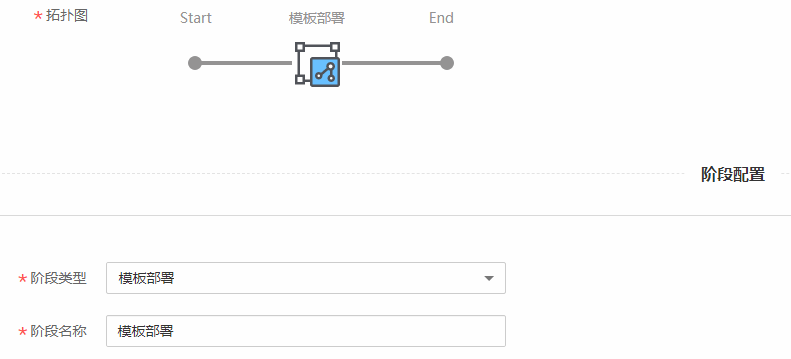
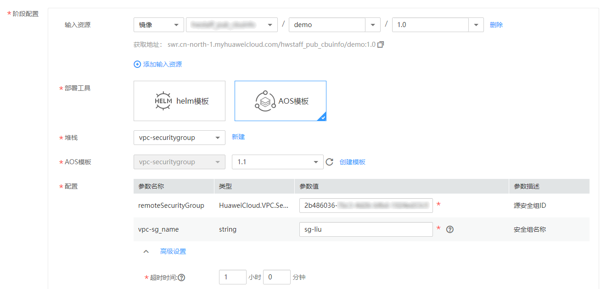

# 使用AOS模板部署镜像

应用编排服务（Application Orchestration Service，简称AOS）为企业提供应用上云的自动化能力，支持编排华为云上的主流云服务，实现在华为云上一键式的应用创建及云服务资源开通，提供高效的一键式云上应用复制和迁移能力。使用AOS，您只需要创建一个描述自己所需的云资源和应用的模板，在模板中自行定义云资源和应用的依赖关系、引用关系等，AOS将根据模板来创建和配置这些云资源和应用。ContainerOps中可通过“模板部署”组件实现使用AOS模板部署镜像。

本章将介绍使用AOS模板部署镜像的方法。

## 操作步骤

1.  登录[ContainerOps控制台](https://console.huaweicloud.com/swr/containerops/)。
2.  在左侧菜单栏选择“流水线“，单击右侧“自定义模板创建“。
3.  配置流水线基本信息。
    -   流水线名称：自定义流水线名称。
    -   流水线组：选择流水线组。
    -   流水线描述：输入描述信息。
    -   执行结果通知：有“异常时通知”和“成功时通知”两种方式可选。勾选后，单击“添加用户”，可选择需要通知的用户，设置邮箱和手机号。
    -   全局变量：已默认设置了SYS\_TIMESTAMP（时间戳）和SYS\_INCREMENT（自增量）全局变量，如需添加新的全局变量，可单击“添加全局变量”。设置的全局变量通过$\{变量名\}的方式，在流水线的配置、脚本中使用。例如：在此处配置环境变量名reponame，则在上传软件包时，可以使用$\{reponame\}来获取值。
    -   拓扑图：展示当前流水线的拓扑图，单击对应图标，可在下方进行阶段配置。

1.  单击拓扑图中的阶段图标，添加阶段，阶段类型为“模板部署”，阶段名称可自定义。

    

2.  配置AOS模板部署信息，单击“提交”，可以保存流水线。

    

    -   输入资源：单击“添加输入资源”可添加输入资源。镜像格式为：组织（必选）/镜像仓库（必选）/Tag（必选）。如需添加镜像，可单击左侧导航栏的“镜像仓库“，前往容器镜像服务上传镜像，上传方法请参见[客户端上传镜像](https://support.huaweicloud.com/usermanual-swr/swr_01_0011.html)。
    -   部署工具：选择“AOS模板”。
    -   堆栈：选择AOS中已创建成功的堆栈。若无可用的堆栈，可单击“新建”，输入堆栈名创建新的堆栈。
    -   AOS模板：选择堆栈使用的模板及版本。若堆栈在AOS中已创建成功，AOS模板将默认为堆栈使用的模板。若无可用的模板，可单击“创建模板”跳转到AOS控制台新建模板。
    -   配置：显示模板中各参数的配置，包括参数名称、类型、参数值和参数描述。
        -   超时时间：您可以自己设置任务最大时间，超过时间后任务会自动停止并判定为错误。

    -   高级选项：添加该阶段的错误处理机制、触发条件和消息通知，实现流水线间的协同联动。

        > **须知：**   
        >流水线各阶段均可设置高级选项，添加对应阶段的错误处理机制、触发条件和消息通知。  

        -   错误处理机制：可选“错误时退回初始节点”、“错误时停止，超时退出”（您可指定超时时间）、“忽略错误继续执行”。
        -   触发条件：支持“webhook”和“内部调用”两种方式。选择webhook，使用webhook类型的URL触发该阶段，该url已默认生成。选择内部调用，使用指定频道触发该阶段。

            如需为触发条件添加传入参数，可单击“添加传入参数”，设置参数名称，选择全局变量，该参数的值将传递给选择的全局变量。

            触发模式可选择“全部触发视为触发”或“任意一个触发即触发”。

            **图 1**  触发条件  
            

        -   消息通知：支持“webhook”和“内部调用”两种方式。执行结果通知可勾选“成功时通知”和“异常时通知”。
            -   选择webhook，使用通知URL进行消息通知，支持POST和GET类型，可添加头域、请求体和参数。

                **图 2**  webhook消息通知  
                

            -   选择内部调用，使用指定频道进行消息通知。如需为消息通知添加传出参数，可单击“添加传出参数”，设置参数名称，选择全局变量，选择的全局变量值将传递给该参数。

                **图 3**  内部调用消息通知  
                

