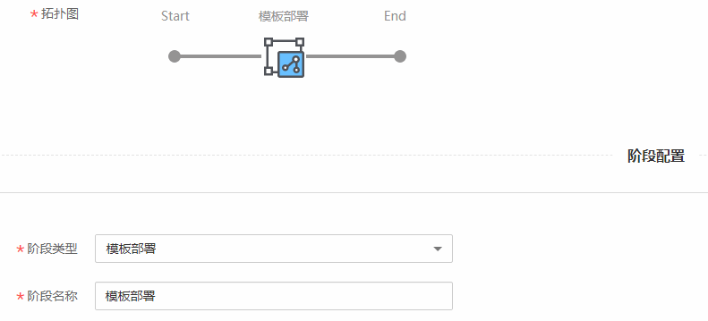
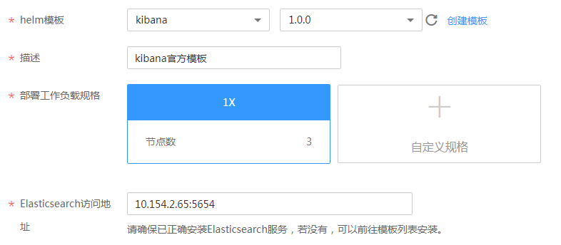
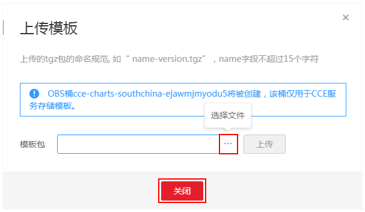
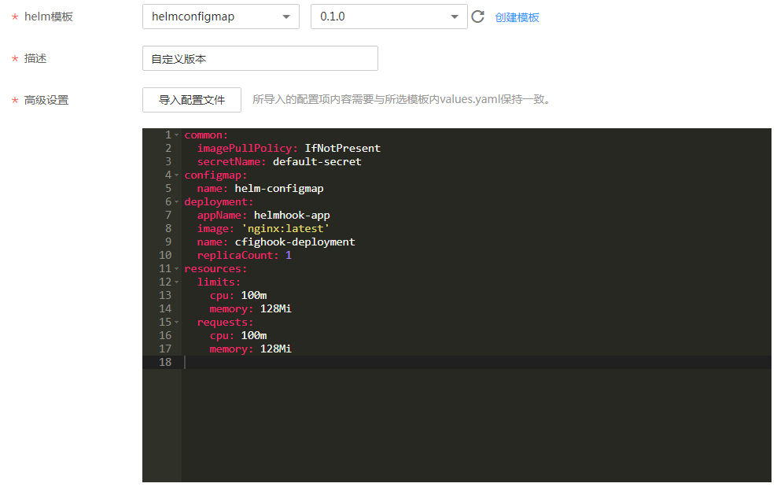

# 使用helm模板部署镜像

Helm是Kubernetes应用的一个包管理工具。Helm通过软件打包的形式，支持发布的版本管理和控制，很大程度上简化了Kubernetes应用部署和管理的复杂性。ContainerOps中可通过“模板部署”组件实现使用helm模板部署镜像。

本章将介绍使用helm模板部署镜像的方法。

## 操作步骤

1.  登录[ContainerOps控制台](https://console.huaweicloud.com/swr/containerops/)。
2.  在左侧菜单栏选择“流水线“，单击右侧“自定义模板创建“。
3.  配置流水线基本信息。
    -   流水线名称：自定义流水线名称。
    -   流水线组：选择流水线组。
    -   流水线描述：输入描述信息。
    -   执行结果通知：有“异常时通知”和“成功时通知”两种方式可选。勾选后，单击“添加用户”，可选择需要通知的用户，设置邮箱和手机号。
    -   全局变量：已默认设置了SYS\_TIMESTAMP（时间戳）和SYS\_INCREMENT（自增量）全局变量，如需添加新的全局变量，可单击“添加全局变量”。设置的全局变量通过$\{变量名\}的方式，在流水线的配置、脚本中使用。例如：在此处配置环境变量名reponame，则在上传软件包时，可以使用$\{reponame\}来获取值。
    -   拓扑图：展示当前流水线的拓扑图，单击对应图标，可在下方进行阶段配置。

1.  单击拓扑图中的阶段图标，添加阶段，阶段类型为“模板部署”，阶段名称可自定义。

    

2.  配置helm模板部署信息，单击“提交”，可以保存流水线。
    -   输入资源：单击“添加输入资源”可添加输入资源。镜像格式为：组织（必选）/镜像仓库（必选）/Tag（必选）。如需添加镜像，可单击左侧导航栏的“镜像仓库“，前往容器镜像服务上传镜像，上传方法请参见[客户端上传镜像](https://support.huaweicloud.com/usermanual-swr/swr_01_0011.html)。
    -   部署工具：选择“helm模板”。
    -   集群：选择镜像对应的集群。若无可用的集群，可单击“创建集群”跳转到[CCE控制台](https://console.huaweicloud.com/cce2.0/#/app/resource/cluster/list)创建集群。
    -   命名空间：选择集群所对应的命名空间。
    -   模板实例名称：选择模板实例。若无可用的模板实例，可单击“新建”创建模板实例。
    -   helm模板：选择helm模板，包括“官方模板”和“我的模板”。
        -   官方模板：指官方提供的供用户部署的应用模板。当前CCE支持redis、etcd、mysql-ndb、mongodb等官方模板。选择官方模板及版本，设置部署工作负载规格等。

            **图 1**  使用官方模板  
            

        -   我的模板：指自定义模板。若无可用的自定义模板，可单击“创建模板”上传模板。

            **图 2**  上传模板  
            

            上传成功后，选择刚上传的自定义模板及版本。在“高级设置”中可修改配置信息，也可以导入配置文件。所导入的配置项内容需要与所选模板内values.yaml保持一致。

            **图 3**  使用自定义模板  
            

    -   描述：填写对部署的描述。
    -   高级选项：添加该阶段的错误处理机制、触发条件和消息通知，实现流水线间的协同联动。

        > **须知：**   
        >流水线各阶段均可设置高级选项，添加对应阶段的错误处理机制、触发条件和消息通知。  

        -   错误处理机制：可选“错误时退回初始节点”、“错误时停止，超时退出”（您可指定超时时间）、“忽略错误继续执行”。
        -   触发条件：支持“webhook”和“内部调用”两种方式。选择webhook，使用webhook类型的URL触发该阶段，该url已默认生成。选择内部调用，使用指定频道触发该阶段。

            如需为触发条件添加传入参数，可单击“添加传入参数”，设置参数名称，选择全局变量，该参数的值将传递给选择的全局变量。

            触发模式可选择“全部触发视为触发”或“任意一个触发即触发”。

            **图 4**  触发条件  
            

        -   消息通知：支持“webhook”和“内部调用”两种方式。执行结果通知可勾选“成功时通知”和“异常时通知”。
            -   选择webhook，使用通知URL进行消息通知，支持POST和GET类型，可添加头域、请求体和参数。

                **图 5**  webhook消息通知  
                

            -   选择内部调用，使用指定频道进行消息通知。如需为消息通知添加传出参数，可单击“添加传出参数”，设置参数名称，选择全局变量，选择的全局变量值将传递给该参数。

                **图 6**  内部调用消息通知  
                

