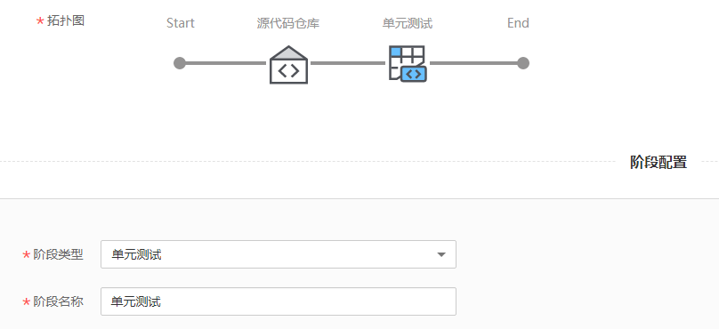
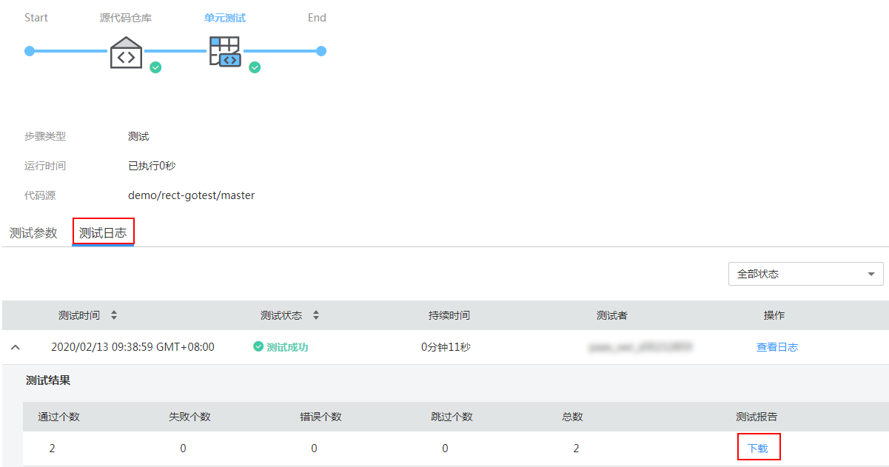
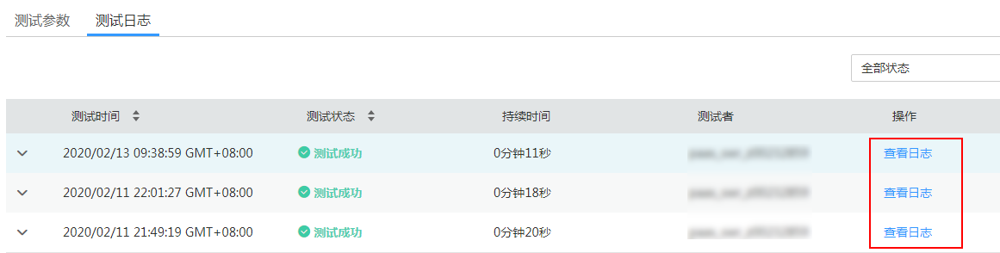

# 使用单元测试组件构建流水线

本章将介绍使用单元测试组件构建流水线的方法。

## 使用须知

-   测试结果的统计要求测试脚本必须符合编码规范。其中，java测试用例需要用maven执行，go测试用例需要在go test后加-v参数。
-   自定义测试环境暂不支持测试结果统计。

## 前提条件

-   构建流水线需要从源代码库中拉取测试用例，请确保测试用例已上传到源代码库中。
-   测试报告会归档到软件包中，请提前创建组织和软件包。

## 操作步骤

1.  登录[ContainerOps控制台](https://console.huaweicloud.com/swr/containerops/)。
2.  在左侧菜单栏选择“流水线“，单击右侧“自定义模板创建“。
3.  配置流水线基本信息。
    -   流水线名称：自定义流水线名称。
    -   流水线组：选择流水线组。
    -   流水线描述：输入描述信息。
    -   执行结果通知：有“异常时通知”和“成功时通知”两种方式可选。勾选后，单击“添加用户”，可选择需要通知的用户，设置邮箱和手机号。
    -   全局变量：已默认设置了SYS\_TIMESTAMP（时间戳）和SYS\_INCREMENT（自增量）全局变量，如需添加新的全局变量，可单击“添加全局变量”。设置的全局变量通过$\{变量名\}的方式，在流水线的配置、脚本中使用。例如：在此处配置环境变量名reponame，则在上传软件包时，可以使用$\{reponame\}来获取值。
    -   拓扑图：展示当前流水线的拓扑图，单击对应图标，可在下方进行阶段配置。

1.  单击拓扑图中的阶段图标，添加阶段，阶段类型为“源代码仓库”，阶段名称可自定义。

    

    配置源代码仓库信息。

    -   代码来源：选择代码来源，您需要先绑定代码源账号，具体操作请参见[绑定代码源账号](绑定代码源账号.md)。

        > **说明：** 
        >当前版本代码来源支持DevCloud、Gitee、Github、GitLab。

        绑定账号后，需要配置以下信息：

        -   命名空间：配置为代码仓库所属的命名空间。
        -   仓库名称：配置为代码仓库的名称。
        -   分支：选择“分支”，可配置代码所属的分支。
        -   标签：选择“标签”，可配置代码对应的标签。

    -   自动构建：当满足勾选的条件（添加新tag时触发流水线、提交代码到分支时触发流水线）时，即触发构建。
        -   Webhook挂载：选择“自动挂载”或“手动挂载”。若选择自动挂载，则会在您选择自动构建以后自动将webhook挂载到对应的源码仓库，若选择手动挂载，则需要您手动复制信息并在对应的源码仓库下创建一个webhook。当您绑定的账号没有创建webhook权限时，建议您选择手动挂载方式，再由高权限的用户手动创建webhook。

    -   高级选项：添加该阶段的错误处理机制、触发条件和消息通知，实现流水线间的协同联动。

        > **须知：** 
        >流水线各阶段均可设置高级选项，添加对应阶段的错误处理机制、触发条件和消息通知。

        -   错误处理机制：可选“错误时退回初始节点”、“错误时停止，超时退出”（您可指定超时时间）、“忽略错误继续执行”。
        -   触发条件：支持“webhook”和“内部调用”两种方式。选择webhook，使用webhook类型的URL触发该阶段，该url已默认生成。选择内部调用，使用指定频道触发该阶段。

            如需为触发条件添加传入参数，可单击“添加传入参数”，设置参数名称，选择全局变量，该参数的值将传递给选择的全局变量。

            触发模式可选择“全部触发视为触发”或“任意一个触发即触发”。

            **图 1**  触发条件  
            

        -   消息通知：支持“webhook”和“内部调用”两种方式。执行结果通知可勾选“成功时通知”和“异常时通知”。
            -   选择webhook，使用通知URL进行消息通知，支持POST和GET类型，可添加头域、请求体和参数。

                **图 2**  webhook消息通知  
                

            -   选择内部调用，使用指定频道进行消息通知。如需为消息通知添加传出参数，可单击“添加传出参数”，设置参数名称，选择全局变量，选择的全局变量值将传递给该参数。

                **图 3**  内部调用消息通知  
                

2.  单击拓扑图中的阶段图标，添加阶段，阶段类型为“单元测试”，阶段名称可自定义。

    

3.  配置单元测试信息，单击“提交”，可以保存流水线。
    -   输入资源：单击“添加输入资源”可添加代码来源。
    -   测试环境：支持Java、Go和自定义。
    -   测试脚本：根据所选择的测试环境自行编写脚本。选择Java或Go时，可使用默认脚本执行。

        > **说明：** 
        >您可以在测试脚本中指定静态扫描命令，ContainerOps集成了golint、goimports、gofmt、findbugs等工具供您使用。

    -   期望用例通过率：设置您期望的用例通过率。例如，设置为80%，用例执行通过率大于等于80%时，流水线构建成功，否则流水线构建失败。

        > **说明：** 
        >测试环境选择“Java”时，才显示该配置项。

    -   测试报告文件：输入测试报告文件归档名称，如cover.out。
    -   测试报告归档路径：设置测试报告归档路径。

## 后续操作

单元测试流水线执行成功后，您可以查看测试用例执行情况、流水线执行日志等。

1.  登录[ContainerOps控制台](https://console.huaweicloud.com/swr/containerops/)。
2.  选择左侧导航栏的“流水线“，单击单元测试的流水线名称，进入流水线详情页面。
3.  在流水线详情页面，可查看流水线执行情况。
    -   查看测试用例执行情况

        在“测试日志”页签下，查看测试用例执行情况。若需下载报告，可单击“下载”。

        

    -   查看流水线执行日志

        单击“查看日志”，可查看流水线执行日志。

        

