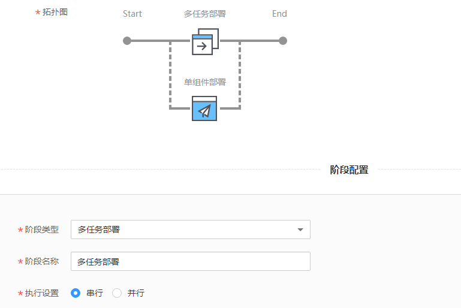
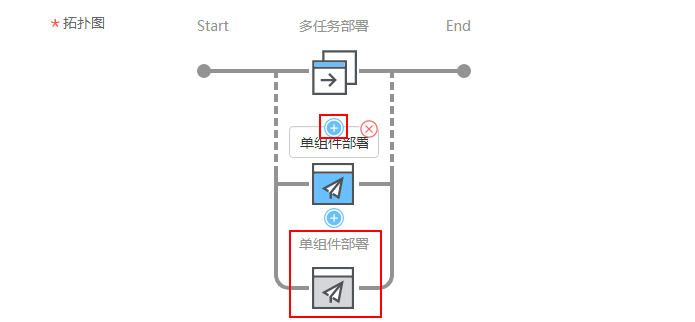

# 使用多任务部署组件构建流水线

本章将介绍使用多任务部署组件构建流水线的方法。

## 使用须知

多任务部署不支持灰度发布。

## 操作步骤

1.  登录[ContainerOps控制台](https://console.huaweicloud.com/swr/containerops/)。
2.  在左侧菜单栏选择“流水线“，单击右侧“自定义模板创建“。
3.  配置流水线基本信息。
    -   流水线名称：自定义流水线名称。
    -   流水线组：选择流水线组。
    -   流水线描述：输入描述信息。
    -   执行结果通知：有“异常时通知”和“成功时通知”两种方式可选。勾选后，单击“添加用户”，可选择需要通知的用户，设置邮箱和手机号。
    -   全局变量：已默认设置了SYS\_TIMESTAMP（时间戳）和SYS\_INCREMENT（自增量）全局变量，如需添加新的全局变量，可单击“添加全局变量”。设置的全局变量通过$\{变量名\}的方式，在流水线的配置、脚本中使用。例如：在此处配置环境变量名reponame，则在上传软件包时，可以使用$\{reponame\}来获取值。
    -   拓扑图：展示当前流水线的拓扑图，单击对应图标，可在下方进行阶段配置。

1.  单击拓扑图中的阶段图标，添加阶段，阶段类型为“多任务部署”，阶段名称可自定义。

    

    当前支持“串行”和“并行”两种多任务执行方式。

    -   串行：多个任务按顺序部署，一个任务部署完成后再执行下一个任务。
    -   并行：多个任务同时部署。

2.  单击单组件部署上方的，可添加其他单组件部署任务，如[图1](#fig18779115231413)。

    **图 1**  添加单组件部署任务  
    

    分别单击拓扑图中的“单组件部署”阶段，配置部署信息，方法请参见[配置“部署”信息](快速创建流水线.md#li529553395318)。

