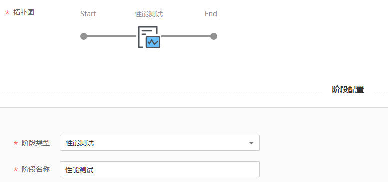
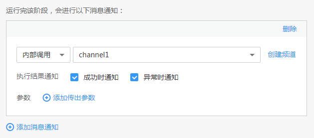

# 使用性能测试组件构建流水线

[云性能测试服务](https://support.huaweicloud.com/productdesc-cpts/cpts_productdesc_0001.html)（Cloud Performance Test Service，简称CPTS）是一项为基于HTTP/HTTPS/TCP/UDP/WEBSOCKET/RTMP/HLS等协议构建的云应用提供性能测试的服务，具备强大的分布式压测能力。ContainerOps中可通过“性能测试”组件为云应用提供性能测试。

本章将介绍使用性能测试组件构建流水线的方法。

## 操作步骤

1.  登录[ContainerOps控制台](https://console.huaweicloud.com/swr/containerops/)。
2.  在左侧菜单栏选择“流水线“，单击右侧“自定义模板创建“。
3.  配置流水线基本信息。
    -   流水线名称：自定义流水线名称。
    -   流水线组：选择流水线组。
    -   流水线描述：输入描述信息。
    -   执行结果通知：有“异常时通知”和“成功时通知”两种方式可选。勾选后，单击“添加用户”，可选择需要通知的用户，设置邮箱和手机号。
    -   全局变量：已默认设置了SYS\_TIMESTAMP（时间戳）和SYS\_INCREMENT（自增量）全局变量，如需添加新的全局变量，可单击“添加全局变量”。设置的全局变量通过$\{变量名\}的方式，在流水线的配置、脚本中使用。例如：在此处配置环境变量名reponame，则在上传软件包时，可以使用$\{reponame\}来获取值。
    -   拓扑图：展示当前流水线的拓扑图，单击对应图标，可在下方进行阶段配置。

1.  单击拓扑图中的阶段图标，添加阶段，阶段类型为“性能测试”，阶段名称可自定义。

    

2.  配置性能测试信息，单击“提交”，可以保存流水线。
    -   测试工程：选择测试工程。如需定义更丰富的测试场景，请到[云性能测试服务](https://console.huaweicloud.com/cpts/#/projects)进行操作，完成后刷新测试工程和测试任务再选择。
    -   测试任务：选择测试任务。如需定义更丰富的测试场景，请到[云性能测试服务](https://console.huaweicloud.com/cpts/#/projects)进行操作，完成后刷新测试工程和测试任务再选择。
    -   测试资源组：选择测试资源组。
        -   共享资源组：共有资源组，无需创建即可使用；共享资源组（外网）支持外网地址压测；共享资源组（内网）支持华为云内网应用地址压测。
        -   云容器CCE资源组：本机创建的云容器CCE资源组。选择虚拟私有云和所在子网。
        -   云容器实例CCI资源组：基于CCI的云容器实例CCI资源组。

    -   预期成功率：当成功率低于预期成功率时，流水线阶段认定为失败。
    -   高级选项：添加该阶段的错误处理机制、触发条件和消息通知，实现流水线间的协同联动。

        > **须知：** 
        >流水线各阶段均可设置高级选项，添加对应阶段的错误处理机制、触发条件和消息通知。

        -   错误处理机制：可选“错误时退回初始节点”、“错误时停止，超时退出”（您可指定超时时间）、“忽略错误继续执行”。
        -   触发条件：支持“webhook”和“内部调用”两种方式。选择webhook，使用webhook类型的URL触发该阶段，该url已默认生成。选择内部调用，使用指定频道触发该阶段。

            如需为触发条件添加传入参数，可单击“添加传入参数”，设置参数名称，选择全局变量，该参数的值将传递给选择的全局变量。

            触发模式可选择“全部触发视为触发”或“任意一个触发即触发”。

            **图 1**  触发条件  
            

        -   消息通知：支持“webhook”和“内部调用”两种方式。执行结果通知可勾选“成功时通知”和“异常时通知”。
            -   选择webhook，使用通知URL进行消息通知，支持POST和GET类型，可添加头域、请求体和参数。

                **图 2**  webhook消息通知  
                

            -   选择内部调用，使用指定频道进行消息通知。如需为消息通知添加传出参数，可单击“添加传出参数”，设置参数名称，选择全局变量，选择的全局变量值将传递给该参数。

                **图 3**  内部调用消息通知  
                

