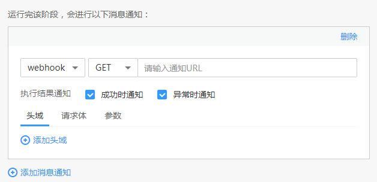

# 使用性能测试组件构建流水线

[云性能测试服务](https://support.huaweicloud.com/productdesc-cpts/cpts_productdesc_0001.html)（Cloud Performance Test Service，简称CPTS）是一项为基于HTTP/HTTPS/TCP/UDP/WEBSOCKET/RTMP/HLS等协议构建的云应用提供性能测试的服务，具备强大的分布式压测能力。ContainerOps中可通过“性能测试”组件为云应用提供性能测试。

本章将介绍使用性能测试组件构建流水线的方法。

## 操作步骤

1.  登录[ContainerOps控制台](https://console.huaweicloud.com/swr/containerops/)。
2.  在左侧菜单栏选择“流水线“，单击右侧“自定义模板创建“。
3.  配置流水线基本信息。
    -   流水线名称：自定义流水线名称。
    -   流水线组：选择流水线组。
    -   流水线描述：输入描述信息。
    -   执行结果通知：有“异常时通知”和“成功时通知”两种方式可选。勾选后，单击“添加用户”，可选择需要通知的用户，设置邮箱和手机号。
    -   全局变量：已默认设置了SYS\_TIMESTAMP（时间戳）和SYS\_INCREMENT（自增量）全局变量，如需添加新的全局变量，可单击“添加全局变量”。设置的全局变量通过$\{变量名\}的方式，在流水线的配置、脚本中使用。例如：在此处配置环境变量名reponame，则在上传软件包时，可以使用$\{reponame\}来获取值。
    -   拓扑图：展示当前流水线的拓扑图，单击对应图标，可在下方进行阶段配置。

1.  单击拓扑图中的阶段图标，添加阶段，阶段类型为“性能测试”，阶段名称可自定义。

    

2.  配置性能测试信息，单击“提交”，可以保存流水线。
    -   测试工程：选择测试工程。如需定义更丰富的测试场景，请到[云性能测试服务](https://console.huaweicloud.com/cpts/#/projects)进行操作，完成后刷新测试工程和测试任务再选择。
    -   测试任务：选择测试任务。如需定义更丰富的测试场景，请到[云性能测试服务](https://console.huaweicloud.com/cpts/#/projects)进行操作，完成后刷新测试工程和测试任务再选择。
    -   测试事务：单击，在弹出的对话框中可编辑事务配置，配置完成后单击“确定”。
        -   事务名称：选择事务名称，也可单击“快速创建”添加事务名称。
        -   元素事务：元素事务的类型包括“报文参数”、“思考时间”、“响应提取”或“检查点”。

            **报文参数：**报文是HTTP应用程序之间发送的数据块。参照[表1](#table178291225164211)设置报文参数，其中带“\*”标志的参数为必填参数。

            **表 1**  报文参数

            
            <table><thead align="left"><tr id="row108261025124213"><th class="cellrowborder" valign="top" width="31.97%" id="mcps1.2.3.1.1">
参数

            </th>
            <th class="cellrowborder" valign="top" width="68.03%" id="mcps1.2.3.1.2">
参数说明

            </th>
            </tr>
            </thead>
            <tbody><tr id="row682611256424"><td class="cellrowborder" valign="top" width="31.97%" headers="mcps1.2.3.1.1 ">
*元素名称

            </td>
            <td class="cellrowborder" valign="top" width="68.03%" headers="mcps1.2.3.1.2 ">
自定义元素名称。

            </td>
            </tr>
            <tr id="row68261425174218"><td class="cellrowborder" colspan="2" valign="top" headers="mcps1.2.3.1.1 mcps1.2.3.1.2 ">
当协议类型为HTTP和HTTPS时，设置以下参数。

            </td>
            </tr>
            <tr id="row12827122511422"><td class="cellrowborder" valign="top" width="31.97%" headers="mcps1.2.3.1.1 ">
*请求类型

            </td>
            <td class="cellrowborder" valign="top" width="68.03%" headers="mcps1.2.3.1.2 "><ul id="ul19827725194214"><li>GET：最常见的一种请求方式，当客户端要从服务器中读取文档时，当单击网页上的链接或者通过在浏览器的地址栏输入网址来浏览网页的，使用的都是GET方式。GET方法要求服务器将URL定位的资源放在响应报文的数据部分，回送给客户端。使用GET方法时，请求参数和对应的值附加在URL后面，利用一个问号（“?”）代表URL的结尾与请求参数的开始，传递参数长度受限制。GET类型不适合传送私密数据，也不适合需要传送大量数据的场景。</li><li>POST：对于不适合GET类型的场景，可考虑POST。POST方法可以允许客户端给服务器提供信息较多。POST方法将请求参数封装在HTTP请求数据中，以名称/值的形式出现，可以传输大量数据，这样POST方式对传送的数据大小没有限制，而且也不会显示在URL中。</li><li>PATCH：是对PUT方法的补充，用来对服务器已有资源进行局部更新。</li><li>PUT：将来自客户端的数据存储到一个命名的服务器资源中去。</li><li>DELETE：从服务器中删除命名资源。</li></ul>
            </td>
            </tr>
            <tr id="row48058504405"><td class="cellrowborder" valign="top" width="31.97%" headers="mcps1.2.3.1.1 ">
*响应超时(ms)

            </td>
            <td class="cellrowborder" valign="top" width="68.03%" headers="mcps1.2.3.1.2 ">
发送请求，等待服务器响应的超时时间。

            
若不设置此参数，默认响应超时时间为5000ms。

            
支持变量输入。

            
 说明： 

变量输入有以下限制：

            <ol id="ol1454285414318"><li>为枚举型变量。</li><li>只能有一个值，且为数字的字符串。</li><li>该数字的范围为20ms到60s。</li></ol>
            

            </td>
            </tr>
            <tr id="row1182782517423"><td class="cellrowborder" valign="top" width="31.97%" headers="mcps1.2.3.1.1 ">
*请求链接

            </td>
            <td class="cellrowborder" valign="top" width="68.03%" headers="mcps1.2.3.1.2 ">
发送请求的URL地址，比如“http://域名/路径”，也可以包含参数的部分“http://域名/路径?key1=value1&amp;key2=value2”。

            
支持变量输入，详情请参见<a href="https://support.huaweicloud.com/usermanual-cpts/cpts_01_0033.html#section1" target="_blank" rel="noopener noreferrer">支持插入变量</a>。

            </td>
            </tr>
            <tr id="row1382792510421"><td class="cellrowborder" valign="top" width="31.97%" headers="mcps1.2.3.1.1 ">
头域

            </td>
            <td class="cellrowborder" valign="top" width="68.03%" headers="mcps1.2.3.1.2 ">
请根据压测服务器需要校验或者使用的头域来添加相关头域及内容。CPTS服务没有对必填头域作要求，仅透传用户定义的头域到压测服务器。“头域”的说明请参见<a href="https://support.huaweicloud.com/usermanual-cpts/cpts_01_0022.html" target="_blank" rel="noopener noreferrer">头域说明</a>。

            
单击“添加头域”，设置“头域”和“值”，若您不需要添加头域信息，可以单击“删除”按钮删除报文头域。

            
 说明： 

请求方式为POST或PUT，且“头域”为“Content-Type”时，“值”有三种类型，且支持插入变量：

            <ul id="ul16234350419"><li>自定义：直接在输入框中输入值。</li><li>application/x-www-form-urlencoded：请求体为可添加的键值对形式，值为文本。</li><li>multipart/form-data：请求体为可添加的键值对形式，值可为文本或文件。值为文件时，支持body体导入。</li></ul>
            

            </td>
            </tr>
            <tr id="row78281525144218"><td class="cellrowborder" colspan="2" valign="top" headers="mcps1.2.3.1.1 mcps1.2.3.1.2 ">
当协议类型为TCP时，设置以下参数。

            
 说明： 

思考时间、报文参数、响应提取、检查点功能都支持TCP协议类型。

            

            </td>
            </tr>
            <tr id="row08281025114210"><td class="cellrowborder" valign="top" width="31.97%" headers="mcps1.2.3.1.1 ">
* IP地址

            </td>
            <td class="cellrowborder" valign="top" width="68.03%" headers="mcps1.2.3.1.2 ">
发送请求到被测服务器的IP地址。

            </td>
            </tr>
            <tr id="row15828102504217"><td class="cellrowborder" valign="top" width="31.97%" headers="mcps1.2.3.1.1 ">
* 端口号

            </td>
            <td class="cellrowborder" valign="top" width="68.03%" headers="mcps1.2.3.1.2 ">
发送请求到被测服务器的端口号。

            </td>
            </tr>
            <tr id="row982815259422"><td class="cellrowborder" valign="top" width="31.97%" headers="mcps1.2.3.1.1 ">
* 链接超时

            </td>
            <td class="cellrowborder" valign="top" width="68.03%" headers="mcps1.2.3.1.2 ">
发起连接，服务器无响应的超时时间。

            </td>
            </tr>
            <tr id="row78281225124216"><td class="cellrowborder" valign="top" width="31.97%" headers="mcps1.2.3.1.1 ">
* 返回超时

            </td>
            <td class="cellrowborder" valign="top" width="68.03%" headers="mcps1.2.3.1.2 ">
连接建立成功，等待响应返回的超时时间。

            </td>
            </tr>
            <tr id="row20828192574218"><td class="cellrowborder" valign="top" width="31.97%" headers="mcps1.2.3.1.1 ">
* 连接设置

            </td>
            <td class="cellrowborder" valign="top" width="68.03%" headers="mcps1.2.3.1.2 "><ul id="ul1082872534212"><li>重复使用连接：请求响应完成后，不断开连接，复用连接发送接收下一次请求响应。</li><li>关闭连接：每次完成请求响应完成后，断开连接，下一次重新建立连接。</li></ul>
            </td>
            </tr>
            <tr id="row9829425104212"><td class="cellrowborder" valign="top" width="31.97%" headers="mcps1.2.3.1.1 ">
* 返回结束设置

            </td>
            <td class="cellrowborder" valign="top" width="68.03%" headers="mcps1.2.3.1.2 ">
通过返回结束设置，来判断本次请求的响应内容是否已经接收完成。

            <ul id="ul78286257421"><li>返回数据长度：设置返回数据的长度，单位字节。当接收到此长度的响应内容时，数据接收完成。</li><li>结束符：设置返回数据的结束标记。当接收到结束符时，数据接收完成 。
 说明： 

结束符建议设置一个唯一的结束标记，若设置的结束符在响应内容中存在多个，当接收到第一个结束符时，就认为响应内容已经接收完成，这样接收的响应数据就不完整。

            

            </li></ul>
            </td>
            </tr>
            <tr id="row982982515428"><td class="cellrowborder" valign="top" width="31.97%" headers="mcps1.2.3.1.1 ">
报文内容

            </td>
            <td class="cellrowborder" valign="top" width="68.03%" headers="mcps1.2.3.1.2 ">
实体的主体部分包含一个由任意数据组成的数据块，并不是所有的报文都包含实体的主体部分，有时，报文只是以一个CRLF结束。

            
内容格式：请根据被测服务器的业务请求内容，选择“字符串”或“16进制码流”。

            
如果已设置全局变量或响应提取的局部变量，可在报文内容部分引用变量，执行压测任务过程会将报文内容中的变量值动态替换为指定的值。

            <ol id="ol1982992524219"><li>在报文内容输入框内输入“$”。</li><li>在“插入变量”对话框中，配置参数。详情请参见<a href="https://support.huaweicloud.com/usermanual-cpts/cpts_01_0033.html#section1" target="_blank" rel="noopener noreferrer">支持插入变量</a>。</li><li>单击“选择”。</li></ol>
            </td>
            </tr>
            <tr id="row1442153264416"><td class="cellrowborder" colspan="2" valign="top" headers="mcps1.2.3.1.1 mcps1.2.3.1.2 ">
当协议类型为UDP时，设置以下参数。

            
 说明： 

思考时间、报文、响应提取、检查点功能都支持UDP协议类型。

            

            </td>
            </tr>
            <tr id="row61201535134415"><td class="cellrowborder" valign="top" width="31.97%" headers="mcps1.2.3.1.1 ">
* IP地址

            </td>
            <td class="cellrowborder" valign="top" width="68.03%" headers="mcps1.2.3.1.2 ">
发送请求到被测服务器的IP地址。

            </td>
            </tr>
            <tr id="row181450378449"><td class="cellrowborder" valign="top" width="31.97%" headers="mcps1.2.3.1.1 ">
* 端口号

            </td>
            <td class="cellrowborder" valign="top" width="68.03%" headers="mcps1.2.3.1.2 ">
发送请求到被测服务器的端口号。

            </td>
            </tr>
            <tr id="row354239204412"><td class="cellrowborder" valign="top" width="31.97%" headers="mcps1.2.3.1.1 ">
* 返回结束设置

            </td>
            <td class="cellrowborder" valign="top" width="68.03%" headers="mcps1.2.3.1.2 ">
通过返回结束设置，来判断本次请求的响应内容是否已经接收完成。

            <ul id="ul238944312461"><li>返回数据长度：设置返回数据的长度，单位字节。当接收到此长度的响应内容时，数据接收完成。</li><li>结束符：设置返回数据的结束标记。当接收到结束符时，数据接收完成 。
 说明： 

结束符建议设置一个唯一的结束标记，若设置的结束符在响应内容中存在多个，当接收到第一个结束符时，就认为响应内容已经接收完成，这样接收的响应数据就不完整。

            

            </li></ul>
            </td>
            </tr>
            <tr id="row18718194214456"><td class="cellrowborder" valign="top" width="31.97%" headers="mcps1.2.3.1.1 ">
报文内容

            </td>
            <td class="cellrowborder" valign="top" width="68.03%" headers="mcps1.2.3.1.2 ">
实体的主体部分包含一个由任意数据组成的数据块，并不是所有的报文都包含实体的主体部分，有时，报文只是以一个CRLF结束。

            
内容格式：请根据被测服务器的业务请求内容，选择“字符串”或“16进制码流”。

            
如果已设置全局变量或响应提取的局部变量，可在报文内容部分引用变量，执行压测任务过程会将报文内容中的变量值动态替换为指定的值。

            <ol id="ol1316782564615"><li>在报文内容输入框内输入“$”。</li><li>在“插入变量”对话框中，配置参数。详情请参见<a href="https://support.huaweicloud.com/usermanual-cpts/cpts_01_0033.html#section1" target="_blank" rel="noopener noreferrer">支持插入变量</a>。</li><li>单击“选择”。</li></ol>
            </td>
            </tr>
            </tbody>
            </table>

            **思考时间：**思考时间是指用户在执行两个连续操作期间的等待时间。如用户在登录和搜索之间停留的时间。例如，某事务每运行一次响应时间为 0.5 秒。

            -   若希望每秒执行两次事务请求，则不添加元素事务类型为“思考时间”的事务请求信息。
            -   若希望每秒只执行一次事务请求，思考时间调整为1秒。如果思考时间设置为1秒而响应时间大于1秒，则思考时间不会生效，按响应时间发送压测请求。

            持续时间支持变量输入，对于变量输入有以下限制：

            1.  为枚举型变量。
            2.  只能有一个值，且为数字的字符串。
            3.  该数字的范围由使用该变量的输入框范围限制决定。

            **响应提取：**如果同一事务中存在多个报文，通过正则表达式把前一个报文的输出提取出来，做后一个报文的输入。开启“添加响应提取”，单击“添加变量”，参照[表2](#table738524254311)设置响应提取参数，其中带“\*”标志的参数为必填参数。

            **表 2**  响应提取

            
            <table><thead align="left"><tr id="row7383124244320"><th class="cellrowborder" valign="top" width="23%" id="mcps1.2.3.1.1">
参数

            </th>
            <th class="cellrowborder" valign="top" width="77%" id="mcps1.2.3.1.2">
参数说明

            </th>
            </tr>
            </thead>
            <tbody><tr id="row19383842134319"><td class="cellrowborder" valign="top" width="23%" headers="mcps1.2.3.1.1 ">
* 变量名称

            </td>
            <td class="cellrowborder" valign="top" width="77%" headers="mcps1.2.3.1.2 ">
变量的名称，命名必须唯一，响应提取的值赋予此变量。

            </td>
            </tr>
            <tr id="row13841542154318"><td class="cellrowborder" valign="top" width="23%" headers="mcps1.2.3.1.1 ">
提取变量范围

            </td>
            <td class="cellrowborder" valign="top" width="77%" headers="mcps1.2.3.1.2 ">
响应提取变量的范围。

            
其中，“报文内容”、“头域”和“URL”可通过正则表达式进行内容提取。

            </td>
            </tr>
            <tr id="row18384164234320"><td class="cellrowborder" valign="top" width="23%" headers="mcps1.2.3.1.1 ">
* 正则表达式

            </td>
            <td class="cellrowborder" valign="top" width="77%" headers="mcps1.2.3.1.2 ">
正则表达式是对字符串操作的一种逻辑公式，就是用事先定义好的一些特定字符、及这些特定字符的组合，组成一个“规则字符串”，这个“规则字符串”用来表达对字符串的一种过滤逻辑。

            
完整的正则表达式由两种字符构成：特殊字符(special characters)称为“元字符”(meta characters)；其它为“文字”(literal)，或者是普通文本字符(normal text characters，如字母、数字、汉字、下划线)。元字符的说明请参见<a href="https://support.huaweicloud.com/usermanual-cpts/cpts_01_0036.html" target="_blank" rel="noopener noreferrer">正则表达式元字符</a>。

            
 说明： 

“()”表示提取，对于您要提取的内容需要用小括号括起来，每个‘()’之间的内容表示一个子表达式。

            

            </td>
            </tr>
            <tr id="row203841942204318"><td class="cellrowborder" valign="top" width="23%" headers="mcps1.2.3.1.1 ">
* 第几个匹配项

            </td>
            <td class="cellrowborder" valign="top" width="77%" headers="mcps1.2.3.1.2 ">
在正则表达式已提取的内容中，获取第几个匹配的内容。

            
取值范围：正整数。

            
 说明： 

该参数值不可设置为0。

            

            </td>
            </tr>
            <tr id="row15385174211433"><td class="cellrowborder" valign="top" width="23%" headers="mcps1.2.3.1.1 ">
* 表达式取值

            </td>
            <td class="cellrowborder" valign="top" width="77%" headers="mcps1.2.3.1.2 ">
表示解析到的第几个子表达式的值。

            
取值范围：自然数。

            
 说明： 

取值为0表示匹配整个正则表达式。

            
取值为1表示匹配正则表达式的第一个子表达式即第一个“()”提取的内容。

            

            
通过“正则表达式”和“第几个匹配项”提取出内容后，再通过“表达式取值”获得最终的提取内容。

            </td>
            </tr>
            <tr id="row1380192194711"><td class="cellrowborder" valign="top" width="23%" headers="mcps1.2.3.1.1 ">
* 需获取的键名

            </td>
            <td class="cellrowborder" valign="top" width="77%" headers="mcps1.2.3.1.2 ">
输入需要获取的键名。

            
例：{"key":{"key1":"v1","key2":{"key3":"v3"},"key4":[{"key41":"v41","key42":"v42"},{"key41":"v43","key42":"v44"}]}}，若想取出"v42"，则输入：key.key4[0].key42。

            
 说明： 

仅在提取内容范围是json内的值时生效。

            

            </td>
            </tr>
            <tr id="row1938524214313"><td class="cellrowborder" valign="top" width="23%" headers="mcps1.2.3.1.1 ">
* 缺省值

            </td>
            <td class="cellrowborder" valign="top" width="77%" headers="mcps1.2.3.1.2 ">
正则匹配或json提取失败时，取的值。

            </td>
            </tr>
            </tbody>
            </table>

            **检查点：**通过自定义校验信息来验证服务端的返回内容是否正确。开启“添加检查点”，参照[表3](#table5736173244417)设置基本信息，其中带“\*”标志的参数为必填参数。

            **表 3**  检查点

            
            <table><thead align="left"><tr id="row13735932174410"><th class="cellrowborder" valign="top" width="21.34%" id="mcps1.2.3.1.1">
参数

            </th>
            <th class="cellrowborder" valign="top" width="78.66%" id="mcps1.2.3.1.2">
参数说明

            </th>
            </tr>
            </thead>
            <tbody><tr id="row2736123219447"><td class="cellrowborder" valign="top" width="21.34%" headers="mcps1.2.3.1.1 ">
响应码

            </td>
            <td class="cellrowborder" valign="top" width="78.66%" headers="mcps1.2.3.1.2 ">
响应报文携带的HTTP/HTTPS协议响应状态码，通常包括1XX，2XX，3XX，4XX，5XX。具体含义详见各协议规范。

            
 说明： 

响应码、头域和内容这三种结果校验参数至少需要设置一种。

            

            </td>
            </tr>
            <tr id="row9736132124413"><td class="cellrowborder" valign="top" width="21.34%" headers="mcps1.2.3.1.1 ">
头域

            </td>
            <td class="cellrowborder" valign="top" width="78.66%" headers="mcps1.2.3.1.2 ">
HTTP/HTTPS协议的Header部分，具体可以支持的Header详见各协议规范。

            <ol id="ol1273643214441"><li>单击“添加头域检查”。</li><li>设置“头域名”，详情请参见<a href="https://support.huaweicloud.com/usermanual-cpts/cpts_01_0022.html" target="_blank" rel="noopener noreferrer">头域说明</a>。</li><li>设置检查条件。</li></ol>
            </td>
            </tr>
            <tr id="row18736203234411"><td class="cellrowborder" valign="top" width="21.34%" headers="mcps1.2.3.1.1 ">
内容

            </td>
            <td class="cellrowborder" valign="top" width="78.66%" headers="mcps1.2.3.1.2 ">
HTTP/HTTPS/TCP/UDP协议的Body部分，为HTTP/HTTPS/TCP/UDP协议请求、响应的负载部分。

            <ol id="ol1873617327447"><li>单击“添加内容检查”。</li><li>设置检查条件。</li></ol>
            </td>
            </tr>
            </tbody>
            </table>

        -   压力设置：设置并发量和压测时长。

    -   测试资源组：选择测试资源组。
        -   共享资源组：共有资源组，无需创建即可使用；共享资源组（外网）支持外网地址压测；共享资源组（内网）支持华为云内网应用地址压测。
        -   虚拟机资源组：本机创建的云容器CCE资源组。选择虚拟私有云和所在子网。
        -   实例化资源组：基于CCI的云容器实例CCI资源组（暂未上线）。

    -   预期成功率：当成功率低于预期成功率时，流水线阶段认定为失败。
    -   高级选项：添加该阶段的错误处理机制、触发条件和消息通知，实现流水线间的协同联动。

        > **须知：**   
        >流水线各阶段均可设置高级选项，添加对应阶段的错误处理机制、触发条件和消息通知。  

        -   错误处理机制：可选“错误时退回初始节点”、“错误时停止，超时退出”（您可指定超时时间）、“忽略错误继续执行”。
        -   触发条件：支持“webhook”和“内部调用”两种方式。选择webhook，使用webhook类型的URL触发该阶段，该url已默认生成。选择内部调用，使用指定频道触发该阶段。

            如需为触发条件添加传入参数，可单击“添加传入参数”，设置参数名称，选择全局变量，该参数的值将传递给选择的全局变量。

            触发模式可选择“全部触发视为触发”或“任意一个触发即触发”。

            **图 1**  触发条件  
            

        -   消息通知：支持“webhook”和“内部调用”两种方式。执行结果通知可勾选“成功时通知”和“异常时通知”。
            -   选择webhook，使用通知URL进行消息通知，支持POST和GET类型，可添加头域、请求体和参数。

                **图 2**  webhook消息通知  
                

            -   选择内部调用，使用指定频道进行消息通知。如需为消息通知添加传出参数，可单击“添加传出参数”，设置参数名称，选择全局变量，选择的全局变量值将传递给该参数。

                **图 3**  内部调用消息通知  
                

