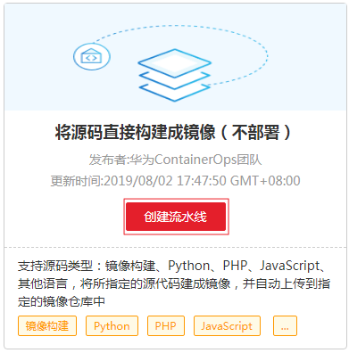

# 使用示例模板创建流水线

ContainerOps的模板市场中提供了多个流水线模板，当前模板市场中提供流水线模板如[表1](模板管理.md#table111331771574)。您可以基于这些示例模板来创建流水线。

## 操作步骤

以“将源码直接构建成镜像（不部署）”为例介绍使用示例模板创建流水线。

1.  登录[ContainerOps控制台](https://console.huaweicloud.com/swr/containerops/)。
2.  选择左侧导航栏的“流水线“，在右侧页面单击“使用示例模板创建“。
3.  单击左侧导航栏的“镜像构建”，在“将源码直接构建成镜像（不部署）”卡片内单击“创建流水线”。

    **图 1**  将源码直接构建成镜像（不部署）  
    

4.  在弹出的对话框中，设置流水线名称，选择流水线组，如果没有流水线组，可单击“新建一个组”创建流水线组，单击“确定”进入流水线配置页面。
5.  设置流水线信息及各阶段配置，请参考[快速创建流水线](快速创建流水线.md)。

