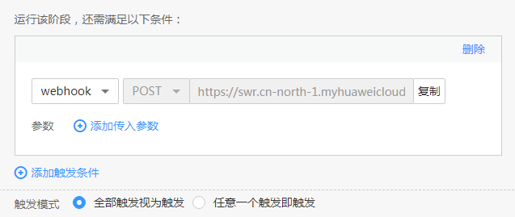

# 使用自定义插件部署自定义构建实例

ContainerOps中可通过“自定义插件”组件在云容器实例（CCI）上部署您自定义的构建实例，并通过流水线为这个实例下发任务。

本章将介绍使用自定义插件部署自定义构建实例的方法。

## 操作步骤

1.  登录[ContainerOps控制台](https://console.huaweicloud.com/swr/containerops/)。
2.  在左侧菜单栏选择“流水线“，单击右侧“自定义模板创建“。
3.  配置流水线基本信息。
    -   流水线名称：自定义流水线名称。
    -   流水线组：选择流水线组。
    -   流水线描述：输入描述信息。
    -   执行结果通知：有“异常时通知”和“成功时通知”两种方式可选。勾选后，单击“添加用户”，可选择需要通知的用户，设置邮箱和手机号。
    -   全局变量：已默认设置了SYS\_TIMESTAMP（时间戳）和SYS\_INCREMENT（自增量）全局变量，如需添加新的全局变量，可单击“添加全局变量”。设置的全局变量通过$\{变量名\}的方式，在流水线的配置、脚本中使用。例如：在此处配置环境变量名reponame，则在上传软件包时，可以使用$\{reponame\}来获取值。
    -   拓扑图：展示当前流水线的拓扑图，单击对应图标，可在下方进行阶段配置。

1.  单击拓扑图中的阶段图标，添加阶段，阶段类型为“源代码仓库”，阶段名称可自定义。

    

    配置源代码仓库信息。

    -   代码来源：选择代码来源，您需要先绑定代码源账号，具体操作请参见[绑定代码源账号](绑定代码源账号.md)。

        > **说明：**   
        >当前版本代码来源支持DevCloud、Gitee、Github、GitLab。  

        绑定账号后，需要配置以下信息：

        -   命名空间：配置为代码仓库所属的命名空间。
        -   仓库名称：配置为代码仓库的名称。
        -   分支：选择“分支”，可配置代码所属的分支。
        -   标签：选择“标签”，可配置代码对应的标签。

    -   自动构建：当满足勾选的条件（添加新tag时触发流水线、提交代码到分支时触发流水线）时，即触发构建。
        -   Webhook挂载：选择“自动挂载”或“手动挂载”。若选择自动挂载，则会在您选择自动构建以后自动将webhook挂载到对应的源码仓库，若选择手动挂载，则需要您手动复制信息并在对应的源码仓库下创建一个webhook。当您绑定的账号没有创建webhook权限时，建议您选择手动挂载方式，再由高权限的用户手动创建webhook。

    -   高级选项：添加该阶段的错误处理机制、触发条件和消息通知，实现流水线间的协同联动。

        > **须知：**   
        >流水线各阶段均可设置高级选项，添加对应阶段的错误处理机制、触发条件和消息通知。  

        -   错误处理机制：可选“错误时退回初始节点”、“错误时停止，超时退出”（您可指定超时时间）、“忽略错误继续执行”。
        -   触发条件：支持“webhook”和“内部调用”两种方式。选择webhook，使用webhook类型的URL触发该阶段，该url已默认生成。选择内部调用，使用指定频道触发该阶段。

            如需为触发条件添加传入参数，可单击“添加传入参数”，设置参数名称，选择全局变量，该参数的值将传递给选择的全局变量。

            触发模式可选择“全部触发视为触发”或“任意一个触发即触发”。

            **图 1**  触发条件  
            

        -   消息通知：支持“webhook”和“内部调用”两种方式。执行结果通知可勾选“成功时通知”和“异常时通知”。
            -   选择webhook，使用通知URL进行消息通知，支持POST和GET类型，可添加头域、请求体和参数。

                **图 2**  webhook消息通知  
                

            -   选择内部调用，使用指定频道进行消息通知。如需为消息通知添加传出参数，可单击“添加传出参数”，设置参数名称，选择全局变量，选择的全局变量值将传递给该参数。

                **图 3**  内部调用消息通知  
                

2.  单击拓扑图中上一阶段旁的，添加阶段，阶段类型为“自定义插件”，阶段名称可自定义。

    

    配置自定义插件信息，单击“提交”。

    -   输入资源：单击“添加输入资源”可添加代码来源。
    -   命名空间：选择云容器实例CCI中已创建的命名空间。若无可用的命名空间，可单击“创建命名空间”跳转到[CCI控制台](https://console.huaweicloud.com/cci/#/app/namespace/list)创建命名空间。

        > **须知：**   
        >-   创建的命名空间下，请安装coredns插件，用于解析容器网络的服务域名。  
        >-   创建的CCI工作负载如需访问外网，请到网络控制台[购买NAT网关](https://support.huaweicloud.com/usermanual-natgateway/zh-cn_topic_0150270259.html)，NAT网关所在VPC、子网指定为CCI命名空间下的VPC、子网。NAT网关创建成功后，您需要创建SNAT规则。通过创建SNAT规则，虚拟私有云子网中全部或部分云主机可以通过共享弹性公网IP访问公网。创建SNAT规则的方法请参见[添加SNAT规则](https://support.huaweicloud.com/usermanual-natgateway/zh-cn_topic_0127489529.html)。  

    -   插件实例：选择插件类型（Jenkins、Gitlab、Buildpack）和插件实例名称。
        -   Jenkins：

            1.  选择Jenkins实例。若无可用的实例，可单击“创建Jenkins实例”创建，如[图4](#fig1460111231181)。

                **图 4**  创建Jenkins实例  
                

                > **说明：**   
                >创建公网ELB实例时，请确保ELB实例所属VPC、子网与CCI命名空间下的VPC、子网相同。  

            创建成功后，CCI将新建两个工作负载，“test-jenkins”（控制节点）和“test-jenkins-slave”（任务节点）。

            **图 5**  jenkins实例创建成功  
            

            您可选择刚创建成功的任务节点“test-jenkins-slave”作为Jenkins实例。

            1.  配置jenkins插件参数。

                **图 6**  配置Jenkins插件参数  
                

                **执行已有任务：**

                -   jenkins任务名称：执行已有任务时无需设置jenkins配置地址，只需填写jenkins已存在的任务名称。

                    jenkins任务名称获取方法：执行已有任务时jenkins任务名称与您业务相关，您需要自行获取。

                    若您选择的Jenkins实例的访问方式为“集群内访问”，您需要填写您第一次创建任务时自定义的jenkins任务名称。

                    若您选择的Jenkins实例的访问方式为“公网访问”，您可登录[云容器实例控制台](https://console.huaweicloud.com/cci/?&locale=zh-cn)，选择“工作负载 -\> 无状态（Deployment）”，单击jenkins实例名称，在“访问配置”下复制公网访问地址。在浏览器中输入该地址，jenkins登录账号为admin，密码与账号相同，在页面中您可获取到jenkins任务名称。

                    **图 7**  复制公网访问地址  
                    

                -   jenkins流水线参数：添加jenkins任务在执行过程中所需要的参数，如版本信息等。您最多可添加20个jenkins参数。

                **通过文件导入任务：**

                -   jenkins配置地址：容器镜像服务存放的jenkins配置文件路径，格式为：组织（必选）/软件仓库（必选）/软件包（必选）/软件包版本（必选）/文件（必选）。jenkins配置地址获取方法：登录[ContainerOps控制台](https://console.huaweicloud.com/swr/containerops/)，选择“软件中心”，单击软件包名称进入详情页面，获取组织/仓库名称、软件包版本和文件名称。

                    jenkins配置文件可以从已有的jenkins中获取，如[图8](#fig29091317670)所示，查找已有的jenkins配置文件，将config.xml内容拷贝到本地文件中，上传到容器镜像服务，上传方法请参见[软件中心](软件中心.md)。

                    **图 8**  查找已有的jenkins配置文件  
                    

                -   jenkins任务名称：输入jenkins任务的名称，您可自定义jenkins任务的名称。
                -   jenkins流水线参数：添加jenkins任务在执行过程中所需要的参数，如版本信息等。您最多可添加20个jenkins参数。

        -   Gitlab：
            1.  选择Gitlab实例，若无可用的实例，可单击“创建Jenkins实例”创建，如[图9](#fig9802423171118)。

                **图 9**  创建Gitlab实例  
                

                创建成功后，CCI将新建两个工作负载，“test-gitlab”（控制节点）和“test-gitlab-runner”（任务节点）。

                **图 10**  Gitlab实例创建成功  
                

                您可选择刚创建成功的任务节点“test-gitlab-runne”作为Gitlab实例。

            2.  配置Gitlab插件参数。

                **图 11**  配置Gitlab插件参数  
                

                -   gitlab工程名称：输入将源码push到的工程名称。
                -   gitlab工程分支：输入将源码push到的工程分支。
                -   gitlab流水线参数：添加gitlab流水线执行过程中所需的参数。您最多可添加20个gitlab参数。

                若您选择的gitlab实例的访问方式为“公网访问”，您可登录[云容器实例控制台](https://console.huaweicloud.com/cci/?&locale=zh-cn)，选择“工作负载 -\> 无状态（Deployment）”，单击gitlab实例名称，在“访问配置”下复制公网访问地址。在浏览器中输入该地址，gitlab登录账号为root，密码与账号相同，在页面中您查看和管理gitlab。

        -   Buildpack：Buidpack不涉及CCI部署，因此无需设置插件参数。

            归档资源：选择镜像归档地址，格式为：组织（必选）/镜像仓库（必选）/Tag（必选）。其中，Tag参数建议通过全局变量的配置和引用来管理版本号，若存在具体版本号，可选择已有版本号进行管理。

## 后续操作

自定义构建实例流水线执行成功后，您可以查看流水线构建参数、构建日志、主实例、从实例、服务列表。

> **说明：**   
>当前仅Jenkins、Gitlab插件类型支持查看主实例、从实例、服务列表，Buildpack插件类型不支持。  

1.  登录[ContainerOps控制台](https://console.huaweicloud.com/swr/containerops/)。
2.  选择左侧导航栏的“流水线“，单击自定义构建实例的流水线名称，进入流水线详情页面。
3.  您可查看流水线构建参数、构建日志、主实例、从实例、服务列表。
    -   构建参数：查看构建的命名空间名称、插件实例类型、插件参数等。

        **图 12**  查看构建参数  
        

    -   构建日志：查看构建时间、构建状态、持续时间、构建者等。
    -   主实例：CCI控制节点工作负载的实例。查看实例运行状态、事件、容器运行状态、日志等。

        **图 13**  查看主实例  
        

    -   从实例：CCI任务节点工作负载的实例。查看实例运行状态、事件、容器运行状态、日志等。

        **图 14**  查看从实例  
        

    -   服务列表：查看工作负载的访问方式、访问地址、访问端口等。

        **图 15**  查看服务列表  
        

