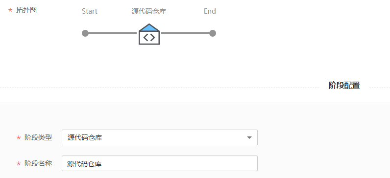
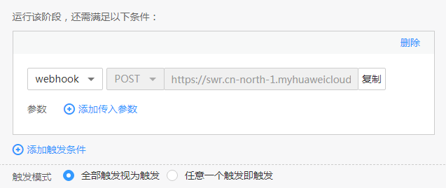
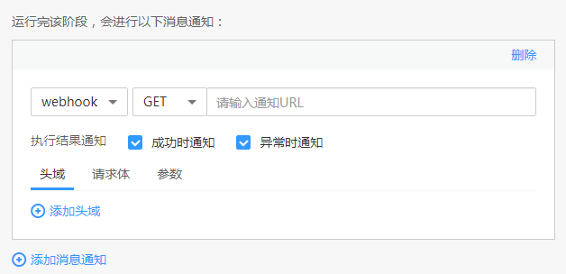
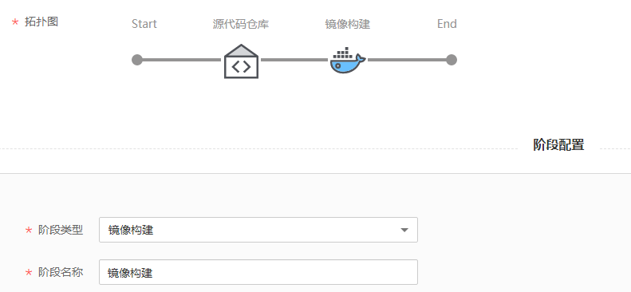
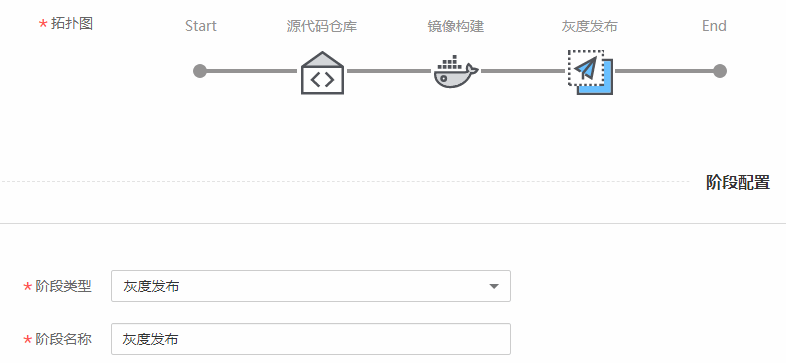
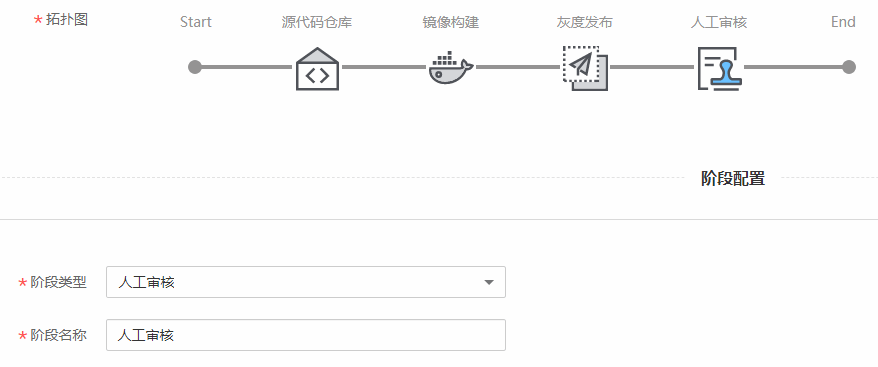
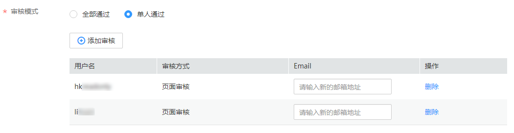
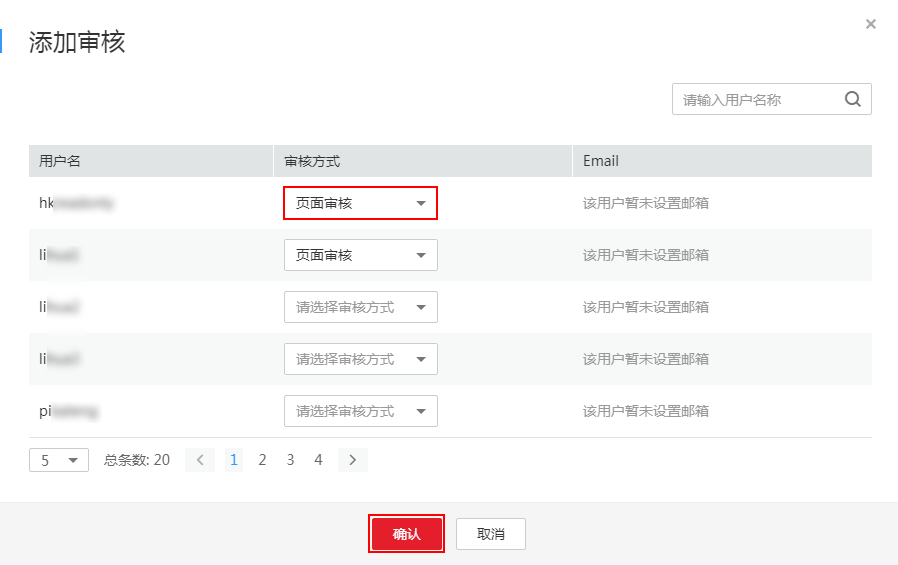
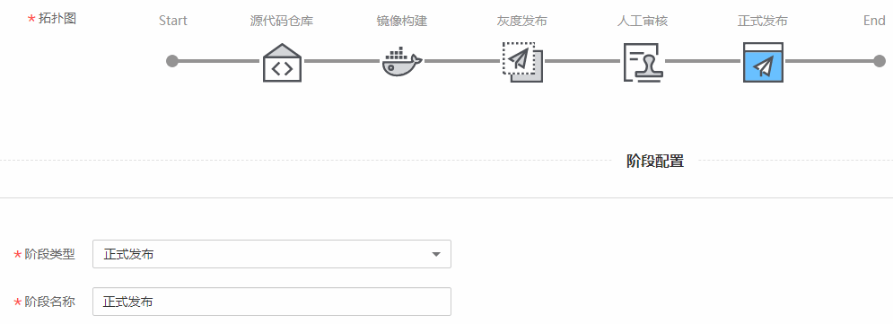

# 基于源码构建镜像进行灰度发布

ContainerOps通过“灰度发布”组件和“正式发布”组件实现灰度发布，并且提供了Istio、金丝雀发布、蓝绿发布三种灰度发布策略，如[表1](#table111331771574)所示。

**表 1**  灰度发布策略

<table><thead align="left"><tr id="row713417195714"><th class="cellrowborder" valign="top" width="13.450000000000001%" id="mcps1.2.4.1.1">
策略名称

</th>
<th class="cellrowborder" valign="top" width="53%" id="mcps1.2.4.1.2">
描述

</th>
<th class="cellrowborder" valign="top" width="33.550000000000004%" id="mcps1.2.4.1.3">
特点

</th>
</tr>
</thead>
<tbody><tr id="row1254122864717"><td class="cellrowborder" valign="top" width="13.450000000000001%" headers="mcps1.2.4.1.1 ">
Istio

</td>
<td class="cellrowborder" valign="top" width="53%" headers="mcps1.2.4.1.2 ">
<a href="https://support.huaweicloud.com/productdesc-istio/istio_productdesc_0001.html" target="_blank" rel="noopener noreferrer">应用服务网格</a>是华为云基于开源Istio推出的服务网格平台，它深度、无缝对接了华为云的企业级Kubernetes集群服务云容器引擎。启用Istio将为您的服务以无侵入的方式提供灵活的服务治理能力。

</td>
<td class="cellrowborder" valign="top" width="33.550000000000004%" headers="mcps1.2.4.1.3 ">
镜像部署的CCE集群需要已启用Istio，才可以使用Istio灰度发布策略。

第一次使用应用服务网格进行灰度升级时会断服。

</td>
</tr>
<tr id="row1113420713577"><td class="cellrowborder" valign="top" width="13.450000000000001%" headers="mcps1.2.4.1.1 ">
金丝雀发布

</td>
<td class="cellrowborder" valign="top" width="53%" headers="mcps1.2.4.1.2 ">
在生产环境上引一部分实际流量对一个新版本进行测试，测试新版本的性能和表现，在保证系统整体稳定运行的前提下，尽早发现新版本在实际环境上的问题。

</td>
<td class="cellrowborder" valign="top" width="33.550000000000004%" headers="mcps1.2.4.1.3 ">
通过在线上运行的服务中，新加入少量的新版本的服务，然后从这少量的新版本中快速获得反馈，根据反馈决定最后的交付形态。

</td>
</tr>
<tr id="row20134576572"><td class="cellrowborder" valign="top" width="13.450000000000001%" headers="mcps1.2.4.1.1 ">
蓝绿发布

</td>
<td class="cellrowborder" valign="top" width="53%" headers="mcps1.2.4.1.2 ">
蓝绿发布提供了一种零宕机的部署方式。不停老版本，部署新版本进行测试，确认OK，将流量切到新版本，然后老版本同时也升级到新版本。始终有两个版本同时在线，有问题可以快速切换。

</td>
<td class="cellrowborder" valign="top" width="33.550000000000004%" headers="mcps1.2.4.1.3 ">
在部署应用的过程中，应用始终在线。并且新版本上线过程中，不会修改老版本的任何内容，在部署期间老版本状态不受影响。只要老版本的资源不被删除，可以在任何时间回滚到老版本。

</td>
</tr>
</tbody>
</table>

本章将以“基于源码构建镜像进行灰度发布”为例介绍ContainerOps进行灰度发布的方法。

## 操作步骤

1.  登录[ContainerOps控制台](https://console.huaweicloud.com/swr/containerops/)。
2.  在左侧菜单栏选择“流水线“，单击右侧“自定义模板创建“。
3.  配置流水线基本信息。
    -   流水线名称：自定义流水线名称。
    -   流水线组：选择流水线组。
    -   流水线描述：输入描述信息。
    -   执行结果通知：有“异常时通知”和“成功时通知”两种方式可选。勾选后，单击“添加用户”，可选择需要通知的用户，设置邮箱和手机号。
    -   全局变量：已默认设置了SYS\_TIMESTAMP（时间戳）和SYS\_INCREMENT（自增量）全局变量，如需添加新的全局变量，可单击“添加全局变量”。设置的全局变量通过$\{变量名\}的方式，在流水线的配置、脚本中使用。例如：在此处配置环境变量名reponame，则在上传软件包时，可以使用$\{reponame\}来获取值。
    -   拓扑图：展示当前流水线的拓扑图，单击对应图标，可在下方进行阶段配置。

1.  单击拓扑图中的阶段图标，添加阶段，阶段类型为“源代码仓库”，阶段名称可自定义。

    

    配置源代码仓库信息。

    -   代码来源：选择代码来源，您需要先绑定代码源账号，具体操作请参见[绑定代码源账号](绑定代码源账号.md)。

        > **说明：**   
        >当前版本代码来源支持DevCloud、Gitee、Github、GitLab。  

        绑定账号后，需要配置以下信息：

        -   命名空间：配置为代码仓库所属的命名空间。
        -   仓库名称：配置为代码仓库的名称。
        -   分支：选择“分支”，可配置代码所属的分支。
        -   标签：选择“标签”，可配置代码对应的标签。

    -   自动构建：当满足勾选的条件（添加新tag时触发流水线、提交代码到分支时触发流水线）时，即触发构建。
        -   Webhook挂载：选择“自动挂载”或“手动挂载”。若选择自动挂载，则会在您选择自动构建以后自动将webhook挂载到对应的源码仓库，若选择手动挂载，则需要您手动复制信息并在对应的源码仓库下创建一个webhook。当您绑定的账号没有创建webhook权限时，建议您选择手动挂载方式，再由高权限的用户手动创建webhook。

    -   高级选项：添加该阶段的错误处理机制、触发条件和消息通知，实现流水线间的协同联动。

        > **须知：**   
        >流水线各阶段均可设置高级选项，添加对应阶段的错误处理机制、触发条件和消息通知。  

        -   错误处理机制：可选“错误时退回初始节点”、“错误时停止，超时退出”（您可指定超时时间）、“忽略错误继续执行”。
        -   触发条件：支持“webhook”和“内部调用”两种方式。选择webhook，使用webhook类型的URL触发该阶段，该url已默认生成。选择内部调用，使用指定频道触发该阶段。

            如需为触发条件添加传入参数，可单击“添加传入参数”，设置参数名称，选择全局变量，该参数的值将传递给选择的全局变量。

            触发模式可选择“全部触发视为触发”或“任意一个触发即触发”。

            **图 1**  触发条件  
            

        -   消息通知：支持“webhook”和“内部调用”两种方式。执行结果通知可勾选“成功时通知”和“异常时通知”。
            -   选择webhook，使用通知URL进行消息通知，支持POST和GET类型，可添加头域、请求体和参数。

                **图 2**  webhook消息通知  
                

            -   选择内部调用，使用指定频道进行消息通知。如需为消息通知添加传出参数，可单击“添加传出参数”，设置参数名称，选择全局变量，选择的全局变量值将传递给该参数。

                **图 3**  内部调用消息通知  
                

2.  单击拓扑图中上一阶段旁的，添加阶段，阶段类型为“镜像构建”，阶段名称可自定义。

    

    配置镜像构建信息。

    -   输入资源：支持“代码来源”、“镜像”、“软件包”。

        镜像格式为：组织（必选）/镜像仓库（必选）/Tag（必选）。如需添加镜像，可单击左侧导航栏的“镜像仓库“，前往容器镜像服务上传镜像，上传方法请参见[客户端上传镜像](https://support.huaweicloud.com/usermanual-swr/swr_01_0011.html)。

        软件包格式为：组织（必选）/软件仓库（必选）/软件包（必选）/软件包版本（必选）/文件（可选）。如需创建软件包，可单击左侧导航栏的“软件中心“，创建方法请参见[软件中心](软件中心.md)。

    -   构建方式：默认为“自定义Dockerfile”。
    -   基础镜像：默认为“自定义”。
    -   Dockerfile：填写Dockerfile路径或在网页填写Dockerfile内容。

        > **说明：**   
        >Dockerfile路径默认为./Dockerfile，表示当前目录下的文件。填写的Dockerfile路径为相对路径，输入资源中的代码或软件包将被下载到构建目录，然后在构建目录执行镜像构建。  

    -   归档资源：选择镜像归档地址，格式为：组织（必选）/镜像仓库（必选）/Tag（必选）。其中，Tag参数建议通过全局变量的配置和引用来管理版本号，若存在具体版本号，可选择已有版本号进行管理。

3.  单击拓扑图中上一阶段旁的，添加阶段，阶段类型为“灰度发布”，阶段名称可自定义。

    

    配置灰度发布信息。

    -   输入资源：单击“添加输入资源”可添加输入资源。镜像格式为：组织（必选）/镜像仓库（必选）/Tag（必选）。如需添加镜像，可单击左侧导航栏的“镜像仓库“，前往容器镜像服务上传镜像，上传方法请参见[客户端上传镜像](https://support.huaweicloud.com/usermanual-swr/swr_01_0011.html)。
    -   部署工具：选择“云容器引擎CCE”，设置以下参数：
        -   集群：若无可用的集群，可单击“创建集群”跳转到[CCE控制台](https://console.huaweicloud.com/cce2.0/#/app/resource/cluster/list)创建集群。若当前所选集群已启用Istio时，灰度发布策略默认选择“Istio”。若当前所选集群未启用Istio时，灰度发布策略可选择“金丝雀”或“蓝绿发布”。
        -   命名空间：配置为集群所对应的命名空间。若无可用的命名空间，可单击“创建命名空间”跳转到[CCE控制台](https://console.huaweicloud.com/cce2.0/#/app/resource/cluster/list)创建命名空间。
        -   工作负载：选择镜像对应的工作负载。
        -   灰度发布策略：支持“Istio”、“金丝雀”、“蓝绿发布”。
            1.  **Istio**：
                -   灰度版本实例数：添加灰度版本实例数量，最多添加300个。
                -   正式版本实例数：当“创建方式”配置为“标准”才显示。添加正式版本实例数量，最多添加300个。
                -   最大无效实例数：当“创建方式”配置为“标准”才显示。每次滚动升级允许的最大无效实例数，如果等于实例数有断服风险（最小存活实例数 = 实例数 - 最大无效实例数）。勾选“百分比”，可设置最大无效实例数占总实例数量的百分比。

            2.  **金丝雀**
                -   灰度版本实例数：添加灰度版本实例数量，最多添加300个。勾选“百分比”，可设置灰度版本实例数占总实例数量的百分比。
                -   实例数量：当“创建方式”配置为“标准”才显示。添加实例数量，最少添加2个，最多添加300个。
                -   最大无效实例数：当“创建方式”配置为“标准”才显示。每次滚动升级允许的最大无效实例数，如果等于实例数有断服风险（最小存活实例数 = 实例数 - 最大无效实例数）。勾选“百分比”，可设置最大无效实例数占总实例数量的百分比。

            3.  **蓝绿发布**
                -   实例数量：当“创建方式”配置为“标准”才显示。添加实例数量，最多添加300个。
                -   最大无效实例数：当“创建方式”配置为“标准”才显示。每次滚动升级允许的最大无效实例数，如果等于实例数有断服风险（最小存活实例数 = 实例数 - 最大无效实例数）。勾选“百分比”，可设置最大无效实例数占总实例数量的百分比。

        -   创建方式：选择“标准”或“yaml”。
        -   镜像更新策略：当“创建方式”配置为“标准”才显示。支持“始终更新”和“版本变化时更新”。
        -   升级方式：当“创建方式”配置为“标准”才显示。创建应用时设置，并且创建后无法修改。
            -   滚动升级：逐步用新版本实例替换旧版本实例。升级过程中，业务会同时均衡分布到新老实例上，因此业务不会中断。
            -   替换升级：替换升级将先把您工作负载的老版本实例删除，再安装指定的新版本。

        -   CPU配额：当“创建方式”配置为“标准”才显示。CPU申请值，指需要预留给容器的CPU值，依据此值选择有足够CPU资源的节点进行配置。CPU限制值，指允许容器使用的CPU最大值。
        -   内存配额：当“创建方式”配置为“标准”才显示。内存申请值，指需要预留给容器的内存值，依据此值选择有足够内存资源的节点进行调度。内存限制值，指允许容器使用的内存最大值。
        -   Manifest：当“创建方式”配置为“yaml”才显示。编辑时需要按照kubernetes的yaml语法编辑manifest。

    -   应用服务配置：服务名称、内部域名访问地址、服务访问方式、访问端口/协议、容器端口/协议已默认设置。单击“编辑”，在“添加服务”对话框中可修改访问协议，目前公网访问应用使用的协议支持TCP和UDP。

        > **须知：**   
        >灰度发布只能使用一个service，不可添加其他应用服务配置。  
        >已生效的访问协议不可修改。  

    -   高级设置：可选项，包括“健康检查”、“容器日志”、“数据存储”、“环境变量”、“生命周期”和“性能管理配置”。详细设置方法请参见[快速创建流水线](快速创建流水线.md)。
    -   灰度策略配置：
        -   访问端口：选择访问端口，例如：9080。

            > **须知：**   
            >部署成功之后访问端口不可修改。  

        -   策略类型：支持“基于流量比例”和“基于请求内容”两种类型。
            -   基于流量比例：对灰度版本配置相应的流量权重，服务流量将会按照权重比率以对应的概率分发当前版本。例如20%的流量走灰度版本，80%的流量走正式版本。
            -   基于请求内容：对灰度版本配置相应的请求内容规则，服务流量在满足此规则的情况下，会走灰度版本。

                **表 2**  基于请求内容设置

                
                <table><thead align="left"><tr id="row3137115714202"><th class="cellrowborder" valign="top" width="31.5%" id="mcps1.2.3.1.1">
参数

                </th>
                <th class="cellrowborder" valign="top" width="68.5%" id="mcps1.2.3.1.2">
参数说明

                </th>
                </tr>
                </thead>
                <tbody><tr id="row141371757172014"><td class="cellrowborder" valign="top" width="31.5%" headers="mcps1.2.3.1.1 ">
Cookie内容

                </td>
                <td class="cellrowborder" valign="top" width="68.5%" headers="mcps1.2.3.1.2 "><ul id="ul3320164842113"><li>完全匹配：当且仅当表达式完全符合此情况时，流量才会走到这个版本。</li><li>正则匹配：此处需要您使用正则表达式来匹配相应的规则。</li></ul>
                </td>
                </tr>
                <tr id="row11371257112010"><td class="cellrowborder" valign="top" width="31.5%" headers="mcps1.2.3.1.1 ">
自定义Header

                </td>
                <td class="cellrowborder" valign="top" width="68.5%" headers="mcps1.2.3.1.2 ">
可以自定义请求头的key和value，value支持完全匹配和正则匹配。

                <ul id="ul277153311262"><li>完全匹配：当且仅当表达式完全符合此情况时，流量才会走到这个版本。</li><li>正则匹配：此处需要您使用正则表达式来匹配相应的规则。</li></ul>
                </td>
                </tr>
                <tr id="row813735715200"><td class="cellrowborder" valign="top" width="31.5%" headers="mcps1.2.3.1.1 ">
允许访问的操作系统

                </td>
                <td class="cellrowborder" valign="top" width="68.5%" headers="mcps1.2.3.1.2 ">
选择允许访问的操作系统，包括iOS、android、windows、MacOS、linux。

                </td>
                </tr>
                <tr id="row111371579205"><td class="cellrowborder" valign="top" width="31.5%" headers="mcps1.2.3.1.1 ">
允许访问的浏览器

                </td>
                <td class="cellrowborder" valign="top" width="68.5%" headers="mcps1.2.3.1.2 ">
选择允许访问的浏览器，包括Chrome、360、IE、Safari、Sogou、Edge。

                </td>
                </tr>
                <tr id="row8244162819275"><td class="cellrowborder" valign="top" width="31.5%" headers="mcps1.2.3.1.1 ">
规则描述

                </td>
                <td class="cellrowborder" valign="top" width="68.5%" headers="mcps1.2.3.1.2 ">
灰度策略的规则描述信息。

                </td>
                </tr>
                <tr id="row2358945182820"><td class="cellrowborder" valign="top" width="31.5%" headers="mcps1.2.3.1.1 ">
已生效规则描述

                </td>
                <td class="cellrowborder" valign="top" width="68.5%" headers="mcps1.2.3.1.2 ">
已生效规则的描述信息。

                </td>
                </tr>
                <tr id="row6927182914277"><td class="cellrowborder" valign="top" width="31.5%" headers="mcps1.2.3.1.1 ">
配置文件

                </td>
                <td class="cellrowborder" valign="top" width="68.5%" headers="mcps1.2.3.1.2 ">
展示策略YAML文件。

                </td>
                </tr>
                </tbody>
                </table>

4.  单击拓扑图中上一阶段旁的，添加阶段，阶段类型为“人工审核”，阶段名称可自定义。

    

    配置人工审核信息。

    **图 4**  审核模式  
    

    -   全部通过：所有审核人员全部通过才可以。
    -   单人通过：审核人员只要有一人通过就可以。

    单击“添加审核”，添加审核人员、选择审核方式，单击“确定”。

    **图 5**  添加审核  
    

5.  单击拓扑图中上一阶段旁的，添加阶段，阶段类型为“正式发布”，阶段名称可自定义。

    

    正式发布信息无需设置，直接单击“提交”。

    > **须知：**   
    >正式发布配置同步于正式发布配置，如需修改请至灰度发布处修改。  

## 相关操作

1.  流水线运行时，“灰度发布”执行成功后，进入“人工审核”阶段，如[图6](#fig1187313153010)。

    **图 6**  审核流水线  
    

    -   审核用户单击“通过”，则执行下一步“正式发布”。
    -   审核用户单击“不通过”，则下一步“正式发布”将不会执行。

1.  流水线运行时，“灰度发布”阶段和“正式发布”阶段执行成功后，支持回退操作，具体请参见[回退流水线](流水线基本操作.md#section395121313129)。

    > **说明：**   
    >灰度发布策略为“Istio”和“蓝绿发布”时，仅支持灰度发布阶段回退，正式发布阶段不支持回退。  

