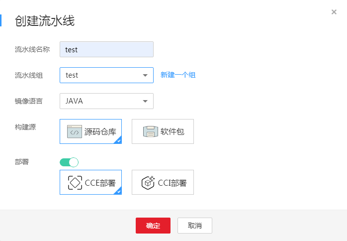

# 快速创建流水线

ContainerOps提供了快速创建流水线的界面操作方法，您可以在流水线中设置代码获取、代码编译、镜像构建和镜像部署等任务。

## 操作步骤

1.  登录[ContainerOps控制台](https://console.huaweicloud.com/swr/containerops/)。
2.  选择左侧导航栏的“流水线“，在右侧页面单击“快速创建流水线（推荐）“。
3.  设置创建流水线信息，单击“确定”进入流水线配置页面。

    **图 1**  创建流水线  
    

    -   流水线名称：设置流水线名称。
    -   流水线组：选择流水线组，如果没有流水线组，可单击“新建一个组”创建流水线组。
    -   镜像语言：“JAVA”、“GO”、“NodeJs”和“其他语言”。
    -   构建源：“源码仓库”或“软件包”。
        -   源码仓库：从代码库获取的源码进行编译后，将所生成的二进制文件构建成镜像。
        -   软件包：用所指定的软件仓库中的文件构建成镜像，并自动上传到指定的镜像仓库中。

    -   部署：可选项，开启后支持“CCE部署”或“CCI部署”。镜像部署的配置方法参见[8](#li529553395318)。

    > **须知：**   
    >-   镜像语言选择“JAVA”、“GO”或“NodeJs”时，构建源可选择“源码仓库”或“软件包”。构建源选择“源码仓库”时，源代码仓库、Jenkins构建-云上和镜像构建的配置方法参见[5](#li1178610045719)、[6](#li491181210578)、[7](#li4916191428)。构建源选择“软件包”时，镜像构建的配置方法参见[7](#li4916191428)。  
    >-   镜像语言选择“其他语言”时，构建源只可选择“源码仓库”，源代码仓库和镜像构建的配置方法参见[5](#li1178610045719)、[7](#li4916191428)。  

4.  配置流水线基本信息。
    -   流水线名称：自定义流水线名称。
    -   流水线组：创建流水线时已设置，不可修改。
    -   流水线描述：输入描述信息。
    -   执行结果通知：有“异常时通知”和“成功时通知”两种方式可选。勾选后，单击“添加用户”，可选择需要通知的用户，设置邮箱和手机号。
    -   全局变量：已默认设置了SYS\_TIMESTAMP（时间戳）和SYS\_INCREMENT（自增量）全局变量，如需添加新的全局变量，可单击“添加全局变量”。设置的全局变量通过$\{变量名\}的方式，在流水线的配置、脚本中使用。例如：在此处配置环境变量名reponame，则在上传软件包时，可通过$\{reponame\}来获取值。
    -   拓扑图：展示当前流水线的拓扑图，单击对应图标，可在下方进行阶段配置。

5.  单击拓扑图中的阶段图标，配置“代码获取”信息，单击“下一步”。

    阶段类型默认为“源代码仓库”。

    -   代码来源：选择代码来源，您需要先绑定代码源账号，具体操作请参见[绑定代码源账号](绑定代码源账号.md)。

        > **说明：**   
        >当前版本代码来源支持DevCloud、Gitee、Github、GitLab。  

        绑定账号后，需要配置以下信息：

        -   命名空间：配置为代码仓库所属的命名空间。
        -   仓库名称：配置为代码仓库的名称。
        -   分支：选择“分支”，可配置代码所属的分支。
        -   标签：选择“标签”，可配置代码对应的标签。

    -   自动构建：当满足勾选的条件（添加新tag时触发流水线、提交代码到分支时触发流水线）时，即触发构建。
        -   Webhook挂载：选择“自动挂载”或“手动挂载”。若选择自动挂载，则会在您选择自动构建以后自动将webhook挂载到对应的源码仓库，若选择手动挂载，则需要您手动复制信息并在对应的源码仓库下创建一个webhook。当您绑定的账号没有创建webhook权限时，建议您选择手动挂载方式，再由高权限的用户手动创建webhook。

    -   高级选项：添加该阶段的错误处理机制、触发条件和消息通知，实现流水线间的协同联动。

        > **须知：**   
        >流水线各阶段均可设置高级选项，添加对应阶段的错误处理机制、触发条件和消息通知。  

        -   错误处理机制：可选“错误时退回初始节点”、“错误时停止，超时退出”（您可指定超时时间）、“忽略错误继续执行”。
        -   触发条件：支持“webhook”和“内部调用”两种方式。选择webhook，使用webhook类型的URL触发该阶段，该url已默认生成。选择内部调用，使用指定频道触发该阶段。

            如需为触发条件添加传入参数，可单击“添加传入参数”，设置参数名称，选择全局变量，该参数的值将传递给选择的全局变量。

            触发模式可选择“全部触发视为触发”或“任意一个触发即触发”。

            **图 2**  触发条件  
            

        -   消息通知：支持“webhook”和“内部调用”两种方式。执行结果通知可勾选“成功时通知”和“异常时通知”。
            -   选择webhook，使用通知URL进行消息通知，支持POST和GET类型，可添加头域、请求体和参数。

                **图 3**  webhook消息通知  
                

            -   选择内部调用，使用指定频道进行消息通知。如需为消息通知添加传出参数，可单击“添加传出参数”，设置参数名称，选择全局变量，选择的全局变量值将传递给该参数。

                **图 4**  内部调用消息通知  
                

6.  单击拓扑图中的阶段图标，配置“代码编译”信息，单击“下一步”。

    阶段类型默认为“Jenkins构建-云上”。

    -   输入资源：支持“代码来源”、“镜像”、“软件包”。

        镜像格式为：组织（必选）/镜像仓库（必选）/Tag（必选）。如需添加镜像，可单击左侧导航栏的“镜像仓库“，前往容器镜像服务上传镜像，上传方法请参见[客户端上传镜像](https://support.huaweicloud.com/usermanual-swr/swr_01_0011.html)。

        软件包格式为：组织（必选）/软件仓库（必选）/软件包（必选）/软件包版本（必选）/文件（可选）。如需创建软件包，可单击左侧导航栏的“软件中心“，创建方法请参见[软件中心](软件中心.md)。

    -   编译环境：对源码进行编译的环境，支持java、go、nodejs或自定义。
    -   构建脚本：对源码进行编译的脚本。
        -   java：默认为mvn package；
        -   go：默认为go build -o myBuild；
        -   nodejs：默认为npm install && npm run build；
        -   自定义：自定义编译环境镜像。

    -   启动缓存构建：选择是否启用构建缓存。勾选后则启动maven、go、nodejs缓存加速构建任务。
    -   归档软件包：填写脚本编译出来的软件包，如：test.jar。
    -   归档资源：选择软件包归档地址，格式为：组织（必选）/软件仓库（必选）/软件包（必选）/软件包版本（必选）/文件（可选，如不填就默认为归档软件包的名称）。建议您定期清理不再使用的软件包，以免超出您的软件仓库配额，导致归档失败。

7.  单击拓扑图中的阶段图标，配置“镜像构建”信息，单击“提交”（如步骤[3](#li390994713479)中开启了部署，则单击“下一步”，配置部署阶段的信息）。

    阶段类型默认为“镜像构建”。

    -   输入资源：支持“代码来源”、“镜像”、“软件包”。

        镜像格式为：组织（必选）/镜像仓库（必选）/Tag（必选）。如需添加镜像，可单击左侧导航栏的“镜像仓库“，前往容器镜像服务上传镜像，上传方法请参见[客户端上传镜像](https://support.huaweicloud.com/usermanual-swr/swr_01_0011.html)。

        软件包格式为：组织（必选）/软件仓库（必选）/软件包（必选）/软件包版本（必选）/文件（可选）。如需创建软件包，可单击左侧导航栏的“软件中心“，创建方法请参见[软件中心](软件中心.md)。

    -   构建方式：系统默认或自定义Dockerfile。选择“系统默认”时，需要配置“基础镜像”、“基础镜像版本”和“对外服务端口”。选择“自定义Dockerfile”时，需要配置“基础镜像”、“Dockerfile”。
    -   基础镜像：Tomcat、Golang、Java。
        -   Tomcat: 使用最新的Tomcat版本作为基础镜像，用于war包的镜像构建 。
        -   Golang：使用最新的Golang版本作为基础镜像，用于go语言二进制的镜像构建 。
        -   Java：使用最新的Java版本作为基础镜像，用于jar包的镜像构建 。

    -   Dockerfile：填写Dockerfile路径或在网页填写Dockerfile内容。
    -   归档资源：选择镜像归档地址，格式为：组织（必选）/镜像仓库（必选）/Tag（必选）。其中，Tag参数建议通过全局变量的配置和引用来管理版本号，若存在具体版本号，可选择已有版本号进行管理。

8.  （可选，当[3](#li390994713479)中部署开启后执行该步骤）单击拓扑图中的阶段图标，配置“部署”信息，单击“提交”。

    阶段类型默认为“正式发布”。

    -   输入资源：支持“代码来源”、“镜像”、“软件包”。

        镜像格式为：组织（必选）/镜像仓库（必选）/Tag（必选）。如需添加镜像，可单击左侧导航栏的“镜像仓库“，前往容器镜像服务上传镜像，上传方法请参见[客户端上传镜像](https://support.huaweicloud.com/usermanual-swr/swr_01_0011.html)。

        软件包格式为：组织（必选）/软件仓库（必选）/软件包（必选）/软件包版本（必选）/文件（可选）。如需创建软件包，可单击左侧导航栏的“软件中心“，创建方法请参见[软件中心](软件中心.md)。

    -   部署工具：选择“云容器引擎CCE”或“云容器实例CCI”。
        1.  选择“云容器引擎CCE”，设置以下参数：
            -   集群：选择镜像对应的集群。若无可用的集群，可单击“创建集群”跳转到[CCE控制台](https://console.huaweicloud.com/cce2.0/#/app/resource/cluster/list)创建集群。
            -   命名空间：配置为集群所对应的命名空间。若无可用的命名空间，可单击“创建命名空间”跳转到[CCE控制台](https://console.huaweicloud.com/cce2.0/#/app/resource/cluster/list)创建命名空间。
            -   工作负载：选择镜像对应的工作负载，若无可用的工作负载，可单击“新建”创建工作负载。
            -   创建方式：“标准”或“yaml”。
            -   镜像更新策略：当“创建方式”配置为“标准”才显示。支持“始终更新”和“版本变化时更新”。
            -   实例数量：当“创建方式”配置为“标准”才显示。添加实例数量，最多添加300个。
            -   升级方式：当“创建方式”配置为“标准”才显示。创建应用时设置，并且创建后无法修改。
                -   滚动升级：逐步用新版本实例替换旧版本实例。升级过程中，业务会同时均衡分布到新老实例上，因此业务不会中断。
                -   替换升级：替换升级将先把您工作负载的老版本实例删除，再安装指定的新版本。

            -   最大无效实例数：每次滚动升级允许的最大无效实例数，如果等于实例数有断服风险（最小存活实例数 = 实例数 - 最大无效实例数）。
            -   CPU配额：当“创建方式”配置为“标准”才显示。CPU申请值，指需要预留给容器的CPU值，依据此值选择有足够CPU资源的节点进行配置。CPU限制值，指允许容器使用的CPU最大值。
            -   内存配额：当“创建方式”配置为“标准”才显示。内存申请值，需要预留给容器的内存值，依据此值选择有足够内存资源的节点进行调度。内存限制值，指允许容器使用的内存最大值。
            -   Manifest：当“创建方式”配置为“yaml”才显示。编辑时需要按照kubernetes的yaml语法编辑manifest。

        2.  选择“云容器实例CCI”，设置以下参数：
            -   命名空间：选择镜像对应的命名空间。若无可用的命名空间，可单击“创建命名空间”跳转到[CCI控制台](https://console.huaweicloud.com/cci/#/app/namespace/list)创建命名空间。
            -   工作负载：选择镜像对应的工作负载，若无可用的工作负载，可单击“新建”创建工作负载。
            -   创建方式：“标准”或“yaml”。
            -   实例数量：当“创建方式”配置为“标准”才显示。添加实例数量，最多添加300个。
            -   GPU加速：当“命名空间”配置为GPU加速型命名空间才显示。勾选“使用GPU加速型”后可选择GPU规格和驱动规格。选择使用GPU加速型后，CPU配额和内存配额将无法设置。
            -   CPU配额：当“创建方式”配置为“标准”才显示。CPU限制值，指允许容器使用的CPU最大值。
            -   内存配额：当“创建方式”配置为“标准”才显示。内存限制值，指允许容器使用的内存最大值。
            -   Manifest：当“创建方式”配置为“yaml”才显示。编辑时需要按照kubernetes的yaml语法编辑manifest。

    -   应用服务配置：选择“工作负载”后才可配置该项。单击“添加服务”，可设置服务名称、访问类型和端口配置。

        > **说明：**   
        >使用CCI部署时，新建工作负载才可添加服务，选择现有应用不可配置应用服务。使用CCE部署时，新建和选择现有工作负载都可配置应用服务。  

    -   高级设置：可选项，包括“健康检查”、“容器日志”、“数据存储”、“环境变量”、“生命周期”和“性能管理配置”。

        > **说明：**   
        >使用CCI部署时，不支持性能管理配置。  

        -   健康检查：健康检查是指容器运行过程中根据用户需要定时检查容器健康状况或是容器中应用的健康状况，可设置“工作负载存活探针”和“工作负载业务探针”。健康检查的配置方法请参见[容器健康检查](https://support.huaweicloud.com/usermanual-cce/cce_01_0112.html)。
        -   容器日志：设置容器日志存储路径，便于统一管理与分析。若不设置将采用默认标准输出，容器日志配置方法请参见[如何设置日志策略](https://support.huaweicloud.com/usermanual-cce/cce_01_0110.html)。
        -   数据存储：支持挂载云硬盘到容器中，以实现数据文件的持久化存储。系统会默认设置使用含云硬盘存储卷部署的无状态工作负载为单实例。数据存储的配置方法请参见[存储概述](https://support.huaweicloud.com/usermanual-cce/cce_01_0042.html)。
        -   环境变量：容器运行环境中设定的一个变量。可以在负载部署后修改，为负载提供极大的灵活性。环境变量的配置方法请参见[设置环境变量](https://support.huaweicloud.com/usermanual-cce/cce_01_0113.html)。
        -   生命周期：生命周期脚本定义，主要针对容器类应用的生命周期事件应用采取的动作。启动命令的配置方法请参见[设置容器启动命令](https://support.huaweicloud.com/usermanual-cce/cce_01_0008.html)。
        -   性能管理配置：[性能管理服务](https://support.huaweicloud.com/productdesc-apm/apm_06_0006.html)协助您快速进行工作负载问题定位与性能瓶颈分析，改善用户体验。

