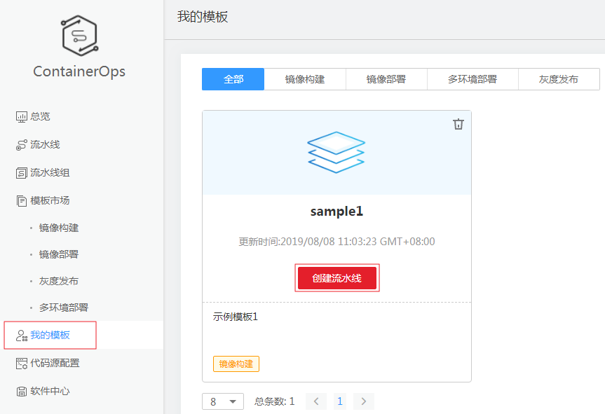

# 模板管理

您可以使用“模板市场”和“我的模板”中的模板创建流水线，模板市场是华为ContainerOps团队提供的流水线示例模板，我的模板存放的是导出的流水线模板。

## 模板市场

ContainerOps的模板市场中提供了多个流水线模板，如[表1](#table111331771574)所示。使用模板市场中的示例模板创建流水线的方法请参见[使用示例模板创建流水线](使用示例模板创建流水线.md)。

**表 1**  模板市场流水线模板

<table><thead align="left"><tr id="row713417195714"><th class="cellrowborder" valign="top" width="15.041504150415042%" id="mcps1.2.4.1.1">
模板类型

</th>
<th class="cellrowborder" valign="top" width="41.724172417241725%" id="mcps1.2.4.1.2">
模板功能

</th>
<th class="cellrowborder" valign="top" width="43.23432343234324%" id="mcps1.2.4.1.3">
示例模板

</th>
</tr>
</thead>
<tbody><tr id="row1113420713577"><td class="cellrowborder" valign="top" width="15.041504150415042%" headers="mcps1.2.4.1.1 ">
镜像构建

</td>
<td class="cellrowborder" valign="top" width="41.724172417241725%" headers="mcps1.2.4.1.2 ">
支持对接Github等源码托管网站构建镜像，代码更新时自动触发镜像构建。

</td>
<td class="cellrowborder" valign="top" width="43.23432343234324%" headers="mcps1.2.4.1.3 "><ul id="ul171441061208"><li>将源码直接构建成镜像（不部署）</li><li>基于源码进行编译后构建镜像</li><li>基于源码和二进制混合构建镜像（不部署）</li><li>基于二进制文件构建镜像（不部署）</li></ul>
</td>
</tr>
<tr id="row20134576572"><td class="cellrowborder" valign="top" width="15.041504150415042%" headers="mcps1.2.4.1.1 ">
镜像部署

</td>
<td class="cellrowborder" valign="top" width="41.724172417241725%" headers="mcps1.2.4.1.2 ">
支持将镜像部署到云容器集群。

</td>
<td class="cellrowborder" valign="top" width="43.23432343234324%" headers="mcps1.2.4.1.3 "><ul id="ul22411519903"><li>基于源码编译并构建镜像进行灰度发布</li><li>基于源码进行编译后构建镜像并部署</li><li>基于源码构建镜像部署后进行性能压测</li><li>基于源码直接构建镜像（无代码编译）</li><li>基于二进制文件构建镜像并审核部署</li><li>基于二进制文件构建镜像并部署</li></ul>
</td>
</tr>
<tr id="row1013411710573"><td class="cellrowborder" valign="top" width="15.041504150415042%" headers="mcps1.2.4.1.1 ">
灰度发布

</td>
<td class="cellrowborder" valign="top" width="41.724172417241725%" headers="mcps1.2.4.1.2 ">
支持Istio、金丝雀发布和蓝绿发布模式。

</td>
<td class="cellrowborder" valign="top" width="43.23432343234324%" headers="mcps1.2.4.1.3 "><ul id="ul1155517511704"><li>基于源码编译并构建镜像进行灰度发布</li></ul>
</td>
</tr>
<tr id="row749113416594"><td class="cellrowborder" valign="top" width="15.041504150415042%" headers="mcps1.2.4.1.1 ">
多环境部署

</td>
<td class="cellrowborder" valign="top" width="41.724172417241725%" headers="mcps1.2.4.1.2 ">
支持“研发-测试-预发布-生产”等多环境协同部署，实现研发-交付全流程自动化，确保部署版本的一致性，提升持续交付效率。

</td>
<td class="cellrowborder" valign="top" width="43.23432343234324%" headers="mcps1.2.4.1.3 ">
-

</td>
</tr>
</tbody>
</table>

## 我的模板

流水线创建成功后，可以将流水线模板导出到“我的模板”中，并使用“我的模板”中的模板创建流水线。

1.  登录[ContainerOps控制台](https://console.huaweicloud.com/swr/containerops/)。
2.  选择左侧导航栏的“流水线“，单击流水线名称，进入流水线详情页面。
3.  单击右上角“导出模板”，可以将该流水线保存并导出到“我的模板”。

    **图 1**  导出模板  
    

4.  在左侧菜单栏选择“我的模板”查看导出的模板。单击“创建流水线”可使用该模板创建流水线。

    **图 2**  查看导出的模板  
    

