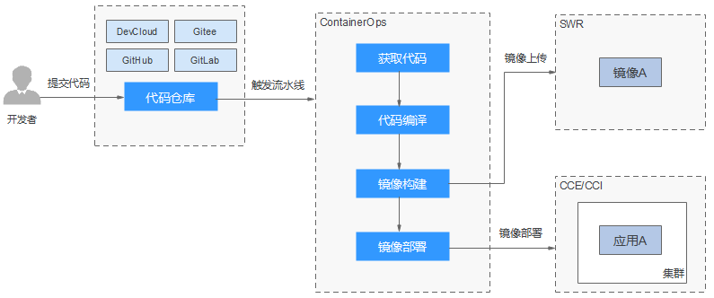

# 欢迎使用容器交付流水线

容器DevOps提供容器化场景下的全流程CI/CD能力，通过使用系统内置流水线或自定义流水线实现从源码到镜像部署的容器化流水线能力。

华为云容器交付流水线（ContainerOps）针对容器DevOps场景，提供持续交付功能，解决容器化场景下，用户从源码到镜像构建、部署过程中的问题，进一步提升容器化场景下的研发、部署和运维效率。

**图 1**  容器交付流水线  

ContainerOps中流水线将定义好的任务用流程串接起来，您可以在流水线中设置代码获取、代码编译、镜像构建和镜像部署等任务。

创建流水线有以下三种方式：

-   **快速创建流水线：**ContainerOps提供了快速创建流水线的界面操作方法，具体请参见[快速创建流水线](快速创建流水线.md)。
-   **使用示例模板创建：**ContainerOps的“模板市场”中提供了多个流水线模板，您可以基于这些示例模板来创建流水线，具体请参见[使用示例模板创建流水线](使用示例模板创建流水线.md)。
-   **自定义模板创建：**ContainerOps提供了流水线拓扑图帮助您创建自定义模板，您可以直接可视化查看流水线各阶段的关系，具体方法请参见[创建自定义流水线](创建自定义流水线.md)。

