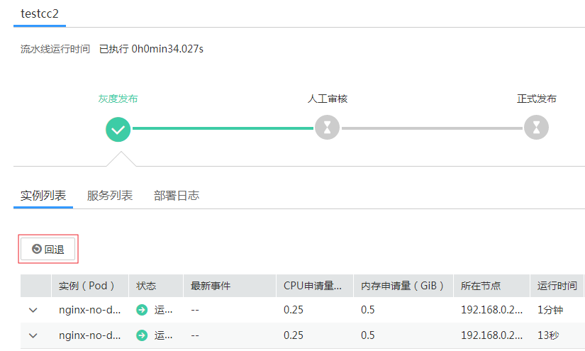

# 流水线基本操作

流水线创建后，您可以对其进行查看、启动、删除等操作。

## 查看流水线

创建流水线后，可以通过查看流水线确认流水线的状态和信息。

1.  登录[ContainerOps控制台](https://console.huaweicloud.com/swr/containerops/)。
2.  选择左侧导航栏的“流水线“，在流水线页面您可执行启动流水线、停止流水线、删除流水线等操作。
    -   启动流水线：单击“启动流水线”，可启动流水线，具体操作请参见[启动/停止流水线](#section417717109442)。

        

    -   停止流水线：执行中的流水线，单击“停止流水线”，可停止流水线，具体操作请参见[启动/停止流水线](#section417717109442)。
    -   删除流水线：单击“删除”，可删除流水线，具体操作请参见[删除流水线](#section22521743184415)。

3.  单击流水线名称，进入流水线详情页面。在流水线详情页面还可查看流水线的拓扑图、各阶段日志、通知信息和触发信息等，单击“编辑”可修改流水线配置信息。

    > **说明：** 
    >当前支持查看最近的20条执行日志。

    **图 1**  流水线详情页面  
    

    当流水线中有正式发布阶段，在流水线详情页面的“部署日志”页签下可查看部署时使用的YAML。

    **图 2**  查看YAML  
    

## 启动/停止流水线

流水线创建成功后，您可以启动流水线。流水线执行过程中，您可以停止流水线。

1.  登录[ContainerOps控制台](https://console.huaweicloud.com/swr/containerops/)。
2.  选择左侧导航栏的“流水线“。
3.  在需要启动的流水线中单击“启动流水线”。如流水线设置了全局变量，还需在弹出的对话框中确认本次执行流水线的全局变量参数是否正确后，单击“启动”。

    > **说明：** 
    >因业务调整，暂时停止套餐包购买功能，如需继续使用，请通过工单系统，申请开通流水线套餐包购买功能，为您带来不便，敬请谅解。

    **图 3**  确认全局变量参数  
    

    当流水线状态为“执行中”时，流水线已启动成功，您可以单击流水线名称查看执行过程。

4.  流水线执行过程中，如需停止流水线，单击“停止流水线”，则流水线停止执行，进入取消状态。

    

## 删除流水线

当您不需要使用流水线时，您可以删除流水线。

1.  登录[ContainerOps控制台](https://console.huaweicloud.com/swr/containerops/)。
2.  选择左侧导航栏的“流水线“。
3.  在需要删除的流水线中单击“删除”。在弹出的对话框中输入DELETE，然后单击“确认“。

    **图 4**  删除流水线  
    

## 回退流水线

ContainerOps当前仅灰度发布阶段和正式发布阶段支持回退，包括两种回退方式：回退到上一次部署的状态、回退到指定版本。

1.  回退到上一次部署的状态

    灰度发布阶段执行成功后，在“实例列表”页签中单击“回退”，在弹出的对话框中单击“确认”后，负载将回退到上一次部署的状态，并且无法取消回退。

    **图 5**  灰度发布阶段回退  
    

    > **说明：** 
    >灰度阶段的回滚按钮只有在还没运行到正式发布阶段时，才会显示。

    正式发布阶段执行成功后，在“实例列表”页签中单击“回退”，在弹出的对话框中单击“确认”后，负载将回退到上一次部署的状态，并且无法取消回退。

    **图 6**  正式发布阶段回退  
    

    > **说明：** 
    >灰度发布策略为“Istio”和“蓝绿发布”时，仅支持灰度发布阶段回退，正式发布阶段不支持回退。

2.  回退到指定版本

    当前仅正式发布阶段支持回退到指定版本，并且流水线中不存在灰度发布阶段时才支持。

    正式发布阶段执行成功后，在“部署日志”页签中指定版本所在行单击“回退至该版本”，负载将回退到该版本部署的状态，并且无法取消回退。

    **图 7**  回退到指定版本  
    

