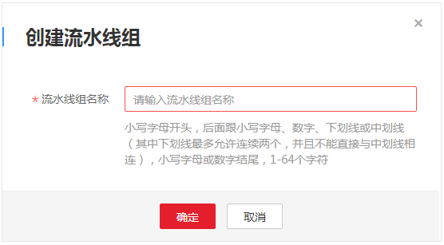
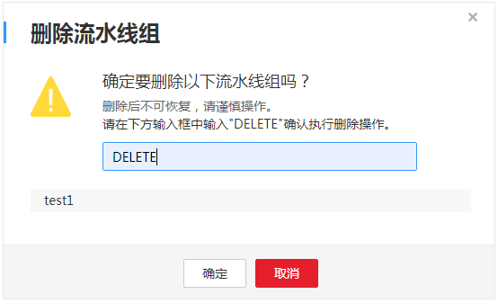
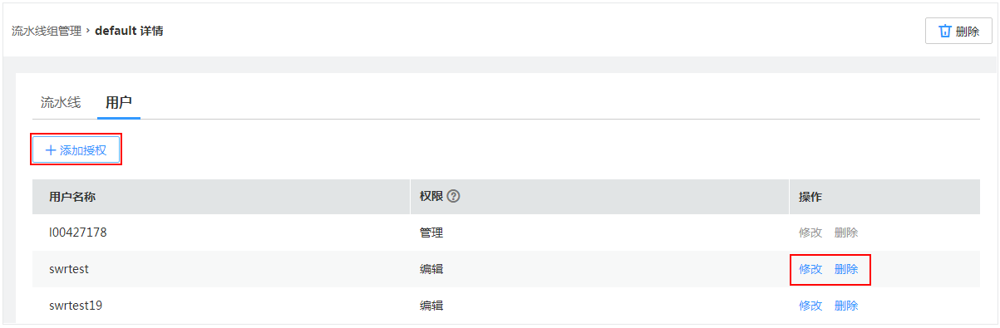

# 流水线组管理

ContainerOps为您提供流水线组管理功能，方便您管理流水线。您可以建立流水线组，将流水线进行分类管理。ContainerOps还支持为租户下不同用户分配相应的流水线访问权限（读取、编辑、管理），具体请参见[授权管理](授权管理.md)。

## 创建流水线组

为了更方便的管理流水线，您可以建立流水线分组，将流水线进行分类管理。

1.  登录[ContainerOps控制台](https://console.huaweicloud.com/swr/containerops/)。
2.  在左侧菜单栏选择“流水线组“，单击右侧“创建流水线组“。
3.  根据页面提示输入“流水线组名称”，租户内名称需要唯一。

    **图 1**  创建流水线组  
    

4.  单击“确定”，完成流水线组的创建。

## 删除流水线组

当您不需要使用流水线组时，您可以删除流水线组。

1.  登录[ContainerOps控制台](https://console.huaweicloud.com/swr/containerops/)。
2.  选择左侧导航栏的“流水线组“，在待删除的流水线组后，单击“详情“。
3.  在流水线组详情页面，单击“删除”。在弹出的对话框中输入DELETE，然后单击“确认“。

    **图 2**  删除流水线组  
    

## 查看流水线组

创建流水线组后，可以查看当前流水线组中的流水线和用户。

1.  登录[ContainerOps控制台](https://console.huaweicloud.com/swr/containerops/)。
2.  选择左侧导航栏的“流水线组“，在待查看的流水线组后，单击“详情“。
3.  在“流水线”页签下，可以查看当前流水线组中的所有流水线。

    在“用户”页签下，可以查看当前流水线组已授权的用户名称和权限、修改和删除已有用户的授权，如[图3](#fig6250817185117)，也可以给其他用户添加授权，添加方法请参见[为用户添加授权](授权管理.md#section1536733193016)。

    **图 3**  查看、修改和删除授权  
    

