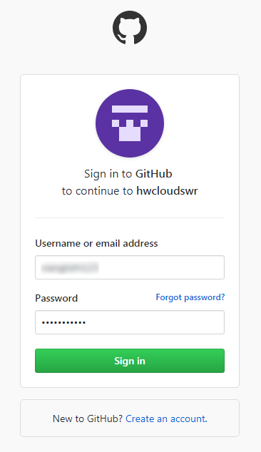
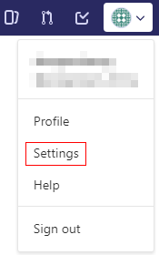
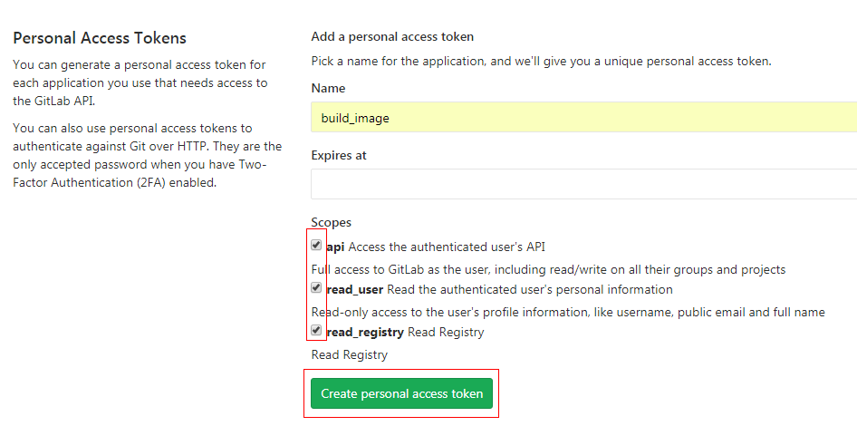
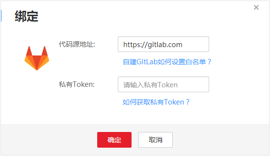
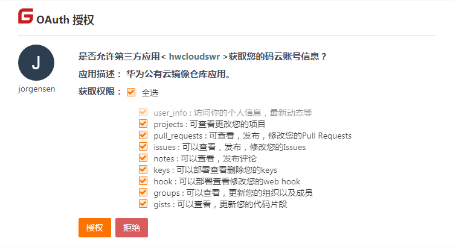

# 绑定代码源账号

ContainerOps支持对接Github等源码托管网站构建镜像，您可以将代码源的账户信息托管给ContainerOps，以实现自动拉取源码，自动构建镜像功能。

构建镜像前，您需要绑定源码托管仓库的账号，授权ContainerOps下载源代码。当前ContainerOps支持DevCloud、Gitee、Github、GitLab。其中DevCloud已默认绑定当前华为云账号。

## 绑定GitHub帐号

1.  登录ContainerOps控制台，选择左侧导航栏的“代码源配置“。
2.  在GitHub所在行，单击“绑定“。
3.  输入用户名和密码，登录GitHub。

    **图 1**  绑定GitHub帐号  
    

4.  在弹出的对话框中单击“确定”，完成绑定。

    > **说明：**   
    >如果不再需要使用此账号，在GitHub所在行单击“解绑”，在弹出的对话框中单击“确定”，账号即解绑成功。  

## 绑定GitLab账号

1.  获取GitLab Access Token。
    1.  登录GitLab：[https://gitlab.com/users/sign\_in](https://gitlab.com/users/sign_in)。
    2.  单击右上角图标，选择  “Settings“。

        **图 2**  选择Settings  
        

    3.  在左侧菜单栏选择“Access Tokens“，填写名称，勾选“read\_registry“选项，单击“Create personal access token“，创建token。

        **图 3**  创建token  
        

    4.  复制并保存token。

2.  （可选）如果您想绑定私有GitLab，您需要把构建节点的相关IP段放入私有GitLab服务的白名单内，具体方法请参见[构建节点与私有GitLab之间的访问](构建节点与私有GitLab之间的访问.md)。
3.  登录ContainerOps控制台，选择左侧导航栏的“代码源配置“。
4.  在GitLab所在行，单击“绑定“，在绑定对话框中输入代码源地址和私有Token后单击“确定“。
    -   代码源地址：默认设置为https://gitlab.com，如果需要绑定私有GitLab，则输入私有GitLab的IP地址。
    -   私有Token：输入[1](#li850713212018)获取的token。

        **图 4** 绑定GitLab帐号  
        

5.  在弹出的对话框中单击“确定”，完成绑定。

    > **说明：**   
    >如果不再需要使用此账号，在GitLab所在行单击“解绑”，在弹出的对话框中单击“确定”，账号即解绑成功。  

## 绑定Gitee账号

1.  登录ContainerOps控制台，选择左侧导航栏的“代码源配置“。
2.  在Gitee所在行，单击“绑定“。
3.  输入用户名和密码，登录Gitee。
4.  单击“授权“。

    **图 5** 绑定Gitee账号  
    

5.  在弹出的对话框中单击“确定”，完成绑定。

    > **说明：**   
    >如果不再需要使用此账号，在Gitee所在行单击“解绑”，在弹出的对话框中单击“确定”，账号即解绑成功。  

