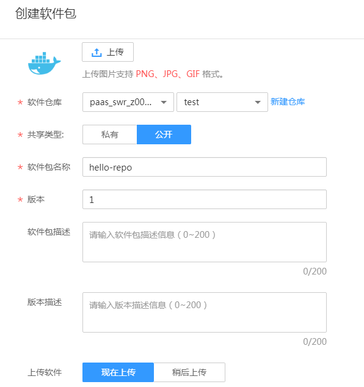
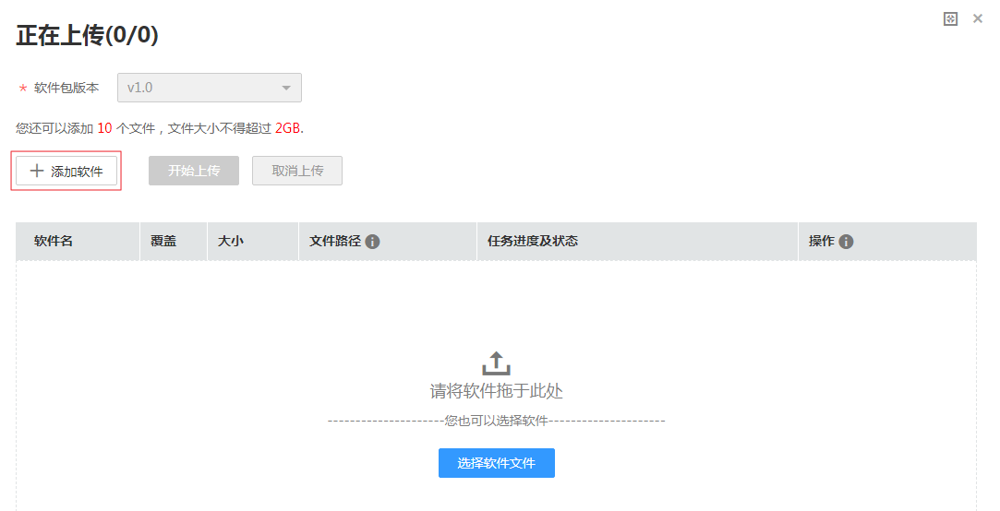
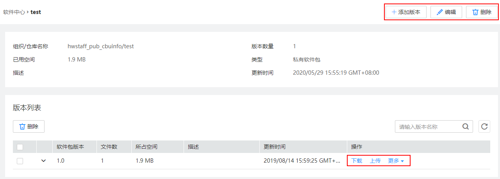
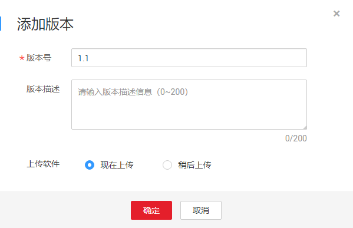
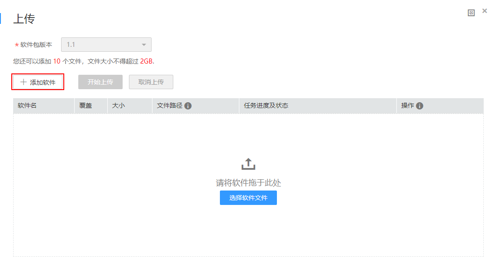
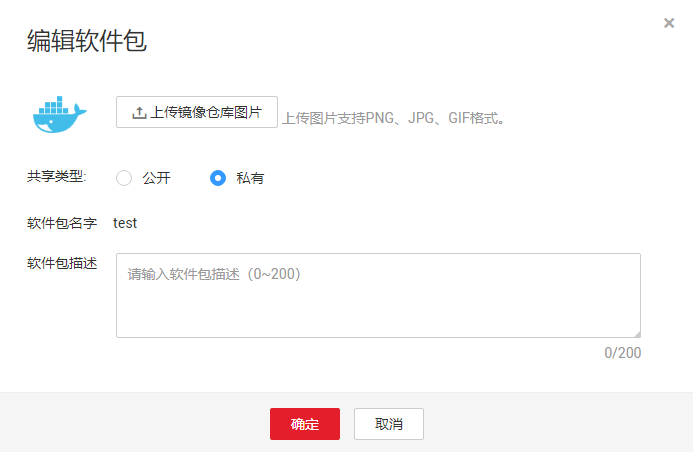
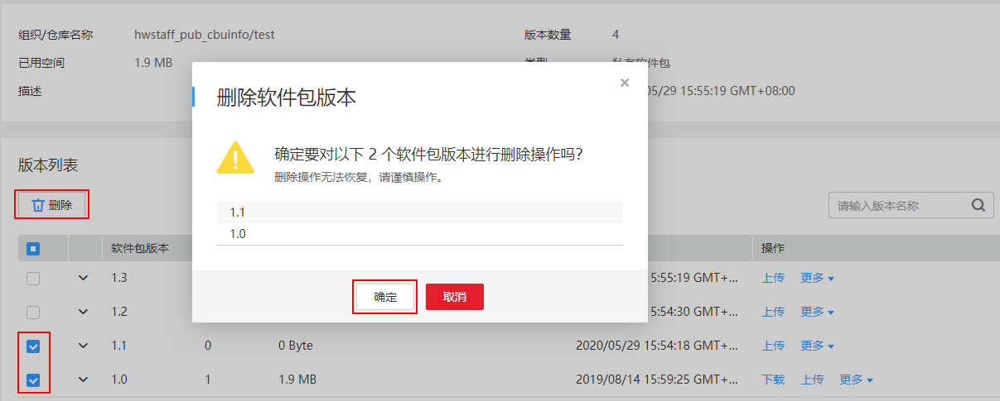

# 软件中心

您可以在此处创建软件包并查看已有的软件包。软件包可作为流水线构建阶段的输入资源。如果软件包较多，您可以通过搜索功能查找目标软件包。

## 创建软件包

1.  登录[ContainerOps控制台](https://console.huaweicloud.com/swr/containerops/)。
2.  在左侧菜单栏选择“软件中心”，单击右侧“创建软件包”。
3.  根据页面提示，配置创建软件包信息，单击“确定”。

    **图 1**  创建软件包  
    

    -   上传：单击“上传”，上传软件包的图片，支持PNG、JPG、GIF格式的图片，可保持默认。
    -   软件仓库：选择软件仓库地址，若无可用的软件仓库，可单击“新建仓库”创建软件仓库。
    -   类型：提供“私有”和“公开”两种共享类型。
    -   软件包名称：输入软件包名称。
    -   版本：输入软件包版本。
    -   软件包描述：输入软件包描述信息。
    -   版本描述：输入版本描述信息。
    -   上传软件：选择“现在上传”或“稍后上传”。

4.  （可选）上传软件包，如[图2](#fig1491910124464)所示。

    > **说明：**   
    >若“上传软件”配置为“现在上传”，则需要执行此步骤。  

    **图 2**  上传软件包  
    

5.  单击“添加软件”，选择软件包，单击“开始上传”。

    上传完成后，显示“上传成功”。

6.  软件包创建成功后，在软件包详情页面可下载该版本软件包，还可以执行添加版本、编辑、删除等操作。

    **图 3**  软件包详情  
    

## 添加软件包版本

1.  登录[ContainerOps控制台](https://console.huaweicloud.com/swr/containerops/)。
2.  在左侧菜单栏选择“软件中心”，单击软件包名称，进入软件包详情。
3.  单击右上角“添加版本”，输入版本号和版本描述，上传软件可选择“现在上传”或“稍后上传”。

    **图 4**  添加版本  
    

4.  （可选）上传新版本软件包，如[图5](#fig16121163855513)所示。

    > **说明：**   
    >若“上传软件”配置为“现在上传”，则需要执行此步骤。  

    **图 5**  上传新版本软件包  
    

5.  添加成功后，在版本列表中可查看添加的软件包版本。

## 编辑软件包

1.  登录[ContainerOps控制台](https://console.huaweicloud.com/swr/containerops/)。
2.  在左侧菜单栏选择“软件中心”，单击软件包名称，进入软件包详情。
3.  单击右上角“编辑”，在弹出的对话框中可修改镜像仓库图片、共享类型和软件包描述，修改完成后单击“确定”。

    **图 6**  编辑软件包  
    

## 删除软件包版本

1.  登录[ContainerOps控制台](https://console.huaweicloud.com/swr/containerops/)。
2.  在左侧菜单栏选择“软件中心”，单击软件包名称，进入软件包详情。
3.  在版本列表中勾选要删除的软件包版本，单击“删除”，在弹出的对话框中单击“确定”。删除操作无法恢复，请谨慎操作。

    **图 7**  删除软件包版本  
    

## 删除软件包

1.  登录[ContainerOps控制台](https://console.huaweicloud.com/swr/containerops/)。
2.  在左侧菜单栏选择“软件中心”。
3.  在需要删除的软件包所在行单击“删除”。在弹出的对话框中单击“确定”。删除操作无法恢复，请谨慎操作。

    > **须知：**   
    >删除软件包前，请先删除软件包中所有的软件包版本。  

