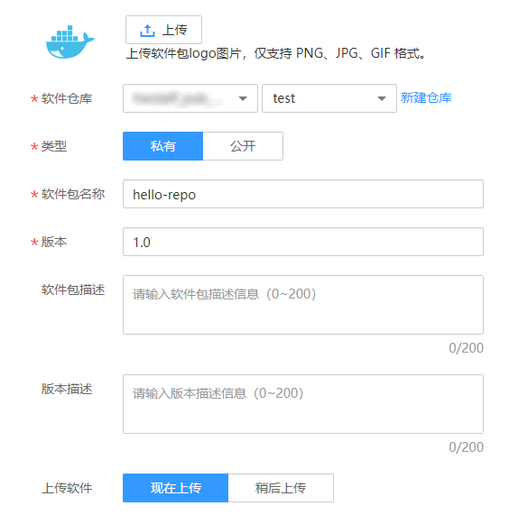

# 软件中心

您可以在此处创建软件包并查看已有的软件包。软件包可作为流水线构建阶段的输入资源。如果软件包较多，您可以通过搜索功能查找目标软件包。

1.  登录[ContainerOps控制台](https://console.huaweicloud.com/swr/containerops/)。
2.  在左侧菜单栏选择“软件中心”，单击右侧“创建软件包”。
3.  根据页面提示，配置创建软件包信息，单击“确定”。

    **图 1**  创建软件包  
    

    -   上传：单击“上传”，上传软件包的图片，支持PNG、JPG、GIF格式的图片，可保持默认。
    -   软件仓库：选择软件仓库地址，若无可用的软件仓库，可单击“新建仓库”创建软件仓库。
    -   共享类型：提供“私有”和“公开”两种共享类型。
    -   软件包名称：输入软件包名称。
    -   版本：输入软件包版本。
    -   软件包描述：输入软件包描述信息。
    -   版本描述：输入版本描述信息。
    -   上传软件：选择“现在上传”或“稍后上传”。

4.  （可选）上传软件包，如[图2](#fig1491910124464)所示。

    > **说明：**   
    >若“上传软件”配置为“现在上传”，则需要执行此步骤。  

    **图 2**  上传软件包  
    

5.  单击“添加软件”，选择软件包，单击“开始上传”。
6.  上传完成后，显示“上传成功”。

